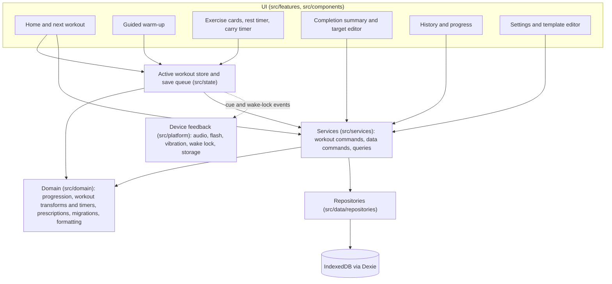
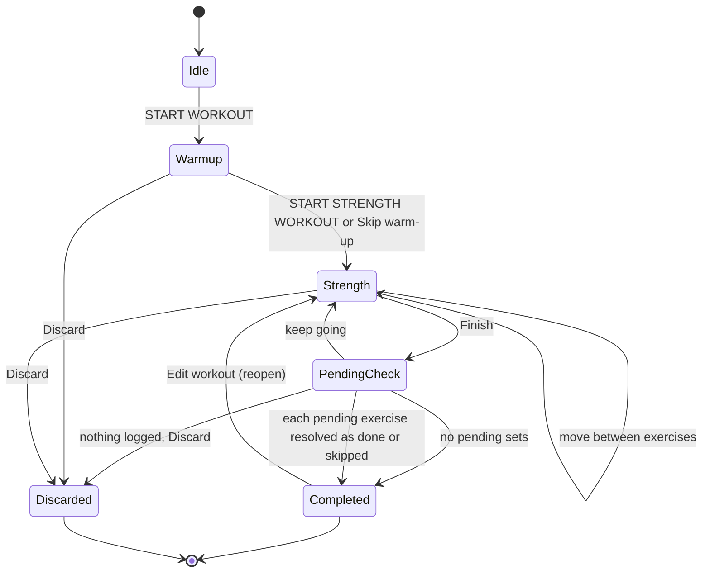
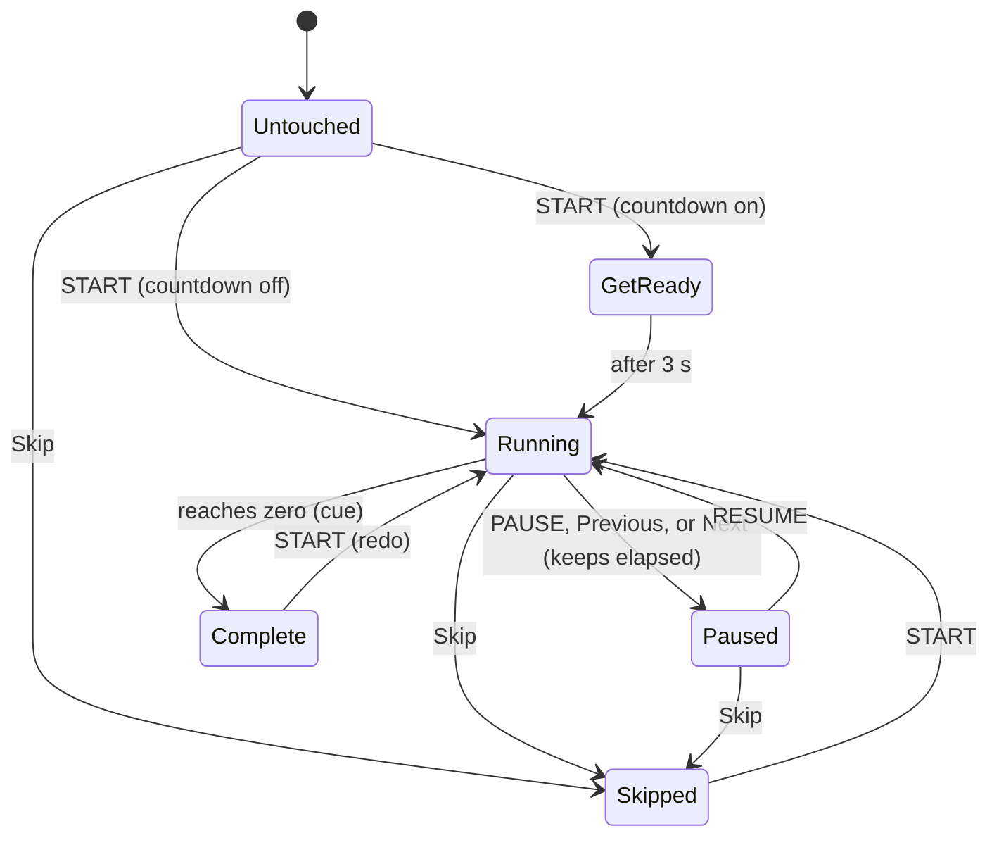
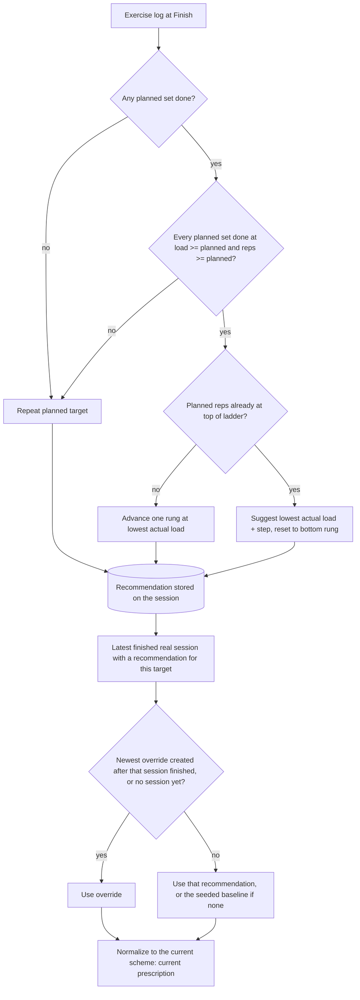
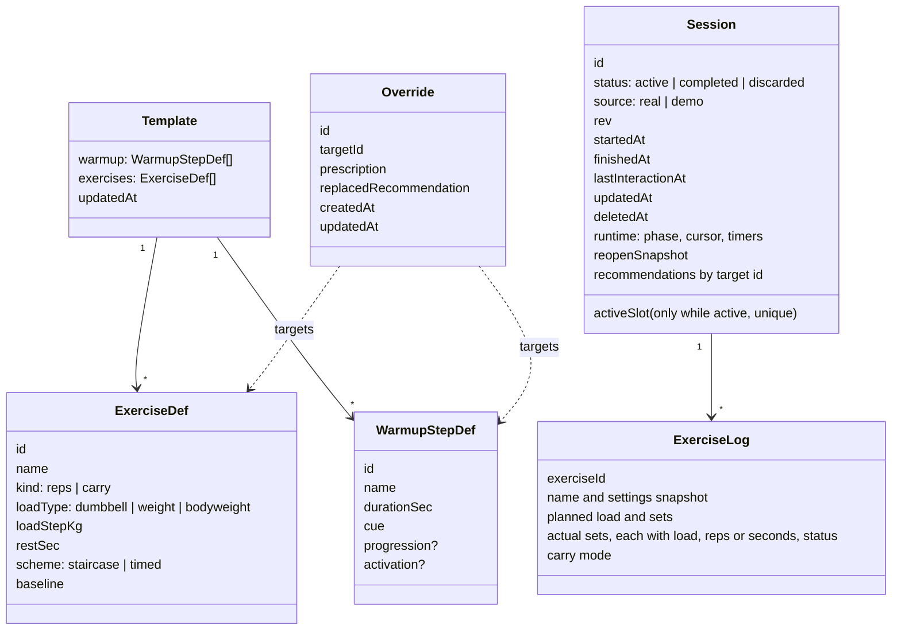

# feat: Build mobile-first upper-body workout tracker PWA

## Summary

Build "Overload", an offline-first React + TypeScript PWA that runs a guided, timed warm-up and a fixed upper-body strength session. Each exercise card shows the load and every set target together, logs actual performance separately from the plan with stepper-only input, and derives the next workout's targets from actual results using transparent ladder progressions. All data lives on the device in IndexedDB behind a repository layer.

---

## Problem Frame

The user trains upper body with a short, stable routine and wants measurable progressive overload without a cluttered fitness app. Mid-workout the phone sits several feet away, hands are busy or sweaty, and the phone may lock, so the app must show exactly what to do at a glance, record what actually happened in a few taps, and never lose a workout. Existing apps either bury the prescription in per-set screens or add social and gamification noise the user explicitly rejects.

The user's spec (sections 1–22 of the request) is the product definition. It was extended with three additions: add a dumbbell bench press, progress jump rope by 10 seconds per workout until 5:00 and then add double unders (duration chosen here), and time the suitcase carry because the user does not count its reps.

---

## Requirements

**Workout content**

- R1. Seed the default workout: warm-up Jump rope 2:00, Shoulder CARs 0:45, Thoracic rotations 0:45, Scapular pull-ups 0:45, Easy push-ups 0:45; strength order Pull-ups, Dips, One-arm DB row, DB bench press, Standing DB overhead press, DB hammer curls, Weighted reverse crunch (10 kg), Suitcase carry (18 kg, 2 sets per side).
- R2. Warm-up steps, exercises, set counts, rep ranges, loads, rest times, and order are editable in Settings (add, remove, rename, reorder).

**Guided warm-up**

- R3. The warm-up is a full-screen guided timer: exercise name and countdown readable from several feet away, START / PAUSE / RESUME, Skip, Previous, Next, and "2 of 5" progress.
- R4. When a step reaches zero the app plays an audible cue, vibrates where supported, marks the step complete, and prepares the next step; an optional 3-second get-ready countdown (on by default) then starts it.
- R5. After the last step the app shows "Warm-up complete" with START STRENGTH WORKOUT.
- R6. Jump rope grows by 10 s after each workout in which it ran its full duration, up to 5:00; after that, a Double unders step joins right after jump rope at 0:30 and grows by 5 s per workout to a 1:00 cap. Increments and caps are editable.

**Strength display and logging**

- R7. Each exercise card shows, in descending visual weight: exercise name, load, today's complete set target (e.g., 5 — 5 — 6), actual result, and last workout — on one screen, never one set per screen.
- R8. Actual load and per-set reps change through large − / + steppers; typing is never required during a workout.
- R9. Logging a set takes one tap and starts the rest timer; skip set, delete added set, and add set exist but stay visually secondary.
- R10. Planned and actual values are stored separately; changing actual values never changes the planned target.
- R11. Dumbbell exercises record the weight of one dumbbell; bodyweight exercises record BW, BW + added kg, or Assisted −kg as a signed delta kept separate from body mass.

**Progression**

- R12. Pull-ups, Dips, DB row, DB bench press, and DB overhead press follow 5/5/5 → 5/5/6 → 5/6/6 → 6/6/6, then suggest a heavier load and restart at 5/5/5; each exercise progresses independently.
- R13. Hammer curls follow 8/8 → 8/9 → 9/9 → 9/10 → 10/10, then suggest heavier dumbbells and restart at 8/8.
- R14. Progression evaluates actual performance: if any planned set is short, skipped, or done at a lighter load than planned, the next target repeats today's target.
- R15. When a bodyweight exercise tops its ladder, the app suggests added resistance and the user chooses the next resistance.
- R16. Reverse crunch progresses by reps first and weight second on its own ladder (not 5–6); the suitcase carry progresses by time per side, then weight.
- R17. The user can always override the automation: next-workout load, reps per set, set count, and ladder stage from Home or the completion screen; exercise order and rest time in Settings; and today's actual load, reps, sets, and rest time during a workout.

**Timers**

- R18. Rest timer: one tap starts it with the exercise default (Pull-ups and Dips 120 s; Row, Bench, and Press 90 s; Hammer curls 75 s; core 60 s); large countdown; +15 s, +30 s, Pause, Skip; sound and vibration at zero.
- R19. The suitcase carry is timed per side: a countdown to the target time, a cue at zero, an automatic side switch, a Carry / March / Static hold selector, and both sides shown clearly.

**Flow and persistence**

- R20. Flow: Home → START WORKOUT → warm-up → strength exercises in template order → Finish → completion summary, with free back/forward movement between exercises and no data loss.
- R21. Every interaction persists to IndexedDB immediately; reopening after refresh, browser close, or phone lock restores the active workout to the same screen, exercise, and timer state.
- R22. The completion screen shows duration, each exercise's target vs actual with ✅ when met, the next target phrased as advance, repeat, or heavier, and a NEXT WORKOUT list.

**History and progress**

- R23. Every finished workout is kept with date, start time, duration, planned and actual load and reps, and completed or skipped sets.
- R24. Each exercise has a history page listing date, load, target, actual, and whether the target was met.
- R25. Progress views, kept outside the workout flow, show load over time, reps over time, completed ladder rungs grouped by load, and the dates resistance increased.
- R26. Realistic demo history ships preloaded and clears in one action, leaving real workouts and baseline targets intact.

**Platform and UX**

- R27. The app is an installable PWA: manifest, icons, standalone display, offline after first load, and a service worker update flow that never reloads mid-workout.
- R28. Mobile-first dark UI with large type, touch targets of at least 48 px, high contrast, one-handed reach, and no dense tables in the workout flow; none of the excluded features ship.
- R29. The data layer sits behind repositories with sync-friendly records (UUIDs, timestamps, soft deletes) so cloud sync and accounts can be added without rebuilding the app.
- R30. The acceptance flow — warm-up, a failed set, a lowered load, finish, verified next targets, reopen, intact history — passes as an automated end-to-end test.

---

## Key Technical Decisions

- KTD1. Stack: Vite 8 + React 19.3 + TypeScript 6.0, React Router 8 (hash router), Zustand 5, Dexie 4.4, CSS Modules over CSS custom-property tokens, no UI kit. Mainstream and maintainable; tokens make the dark theme, large type scale, and a light option cheap; no kit fights the oversized touch targets. Svelte or Solid were rejected for thinner PWA, testing, and IndexedDB tooling. TypeScript stays on `~6.0` because TypeScript 7 (the native rewrite) ships no JS API and typescript-eslint does not support it yet.
- KTD2. Pure domain layer. `src/domain/` holds types, the progression engine, workout transforms and timers, session building and finishing, prescription derivation, migrations, history aggregation, and formatting, with no React or Dexie imports. This satisfies "progression logic separate from UI" and lets the rules be unit-tested exhaustively.
- KTD3. One generic staircase progression. A success adds one rep to the rightmost set holding the fewest reps; when every set is at the top of the range, the engine suggests the load step and resets all sets to the bottom. Parameters (set count, min reps, max reps) reproduce the user's exact 5–6 and 8–10 ladders, give reverse crunch a 10–15 ladder, and still work for custom overrides and changed set counts. A timed variant (target seconds, step, cap) serves the carry and the warm-up rope.
- KTD4. Evaluation rule. Success means every planned set was done with load ≥ planned load and reps ≥ planned reps; extra added sets never count against success. Success advances one rung from the planned target at the lowest actual load used across the planned sets, or, at the top rung, adds the load step to that lowest actual load and resets to the bottom rung; failure repeats the planned target exactly. Over-performance never skips rungs, which keeps the ladder predictable.
- KTD5. Derived current prescription. The next target for any exercise or progressive warm-up step comes from the latest finished real session (by original finish time) that carries a recommendation for it, unless the newest manual override for that target was created after that session finished (or no real session carries the target yet), falling back to the seeded baseline; the result is normalized against the current scheme (a set-count or rep-range change resets to the bottom rung at the same load). Every finished session stores a recommendation for every exercise and progressive warm-up step it snapshotted, including inactive double unders, so the newest-first scan usually stops at the first session. Demo sessions never feed targets or LAST TIME. A stored per-exercise target table was rejected because every delete, reopen, or import would need replay logic; the cost is a newest-first history scan per read, done in one read transaction that stops at each target's first hit.
- KTD6. One document per workout. A session record holds the warm-up log, ordered exercise logs with planned sets and actual sets (each actual set carries its own load, so a mid-exercise weight drop is recorded exactly), snapshotted rest times, and a `runtime` field (phase, cursor by exercise id, timers) that finishing clears. Normalized session, exercise, and set tables were rejected: one document makes every save a single atomic write and keeps export simple, at the cost of loading whole workouts for per-exercise views. Dexie tables: `sessions`, `overrides`, and a key-value table for the template, settings, and meta flags; indexed flags are strings or numbers because IndexedDB does not index booleans or null. Repositories wrap Dexie; UI and store code never import Dexie directly.
- KTD7. Active-workout store. A Zustand store holds the active session, applies pure domain transforms synchronously for instant UI, and hands each snapshot to a save queue. Using Dexie live queries as the only source of truth was rejected because it puts an IndexedDB round trip between every tap and its display. The store is the only writer of the active workout; every other screen reads Dexie through live queries, so nothing is stale after Finish.
- KTD8. Timestamp timers. Every timer stores an `endsAt` wall-clock timestamp (`Date.now()`, never `performance.now()`, which resets on reload) while running and `remainingMs` while paused, persisted in the session. Counting intervals was rejected because background throttling and iOS freezing lose time; the trade-off is trusting the device clock, so remaining time is clamped to 0–duration. `tick` and `resync` are one pure, idempotent function run by the ticker, on startup, when the page becomes visible, and on `pageshow`: it resolves every timer that ended while hidden exactly once, never chains into further steps while hidden, and emits cues only for transitions within the last second. The save queue also flushes when `visibilitychange` reports hidden, the last event mobile browsers reliably deliver, and on `pagehide`.
- KTD9. Feedback primitives. Beeps are synthesized with Web Audio (no audio files), unlocked inside a tap by resuming the context and playing a silent buffer. The default audio session is ambient, so the user's music keeps playing but the iPhone silent switch mutes cues; an "Always audible (pauses music)" setting switches the Safari audio session to playback. Every cue also flashes the full screen, because iOS has no Vibration API; `navigator.vibrate` is used where it exists. On becoming visible the app revives a suspended audio context and recreates it on the next tap if it is stuck. A Screen Wake Lock is held during an active workout and re-requested on visibility changes; because iOS requires a tap for the first request after each page load, a restored workout shows "Tap to keep screen on" until a tap re-acquires it. Audio unlock and wake-lock requests run synchronously inside a global tap listener, never after an awaited database write, because iOS only honors them within the gesture. The first START plays a one-time sound check; if the user did not hear it, the app explains that Silent Mode mutes cues and offers "Always audible". Device APIs subscribe to store events, so the workout engine stays testable without them.
- KTD10. Explicit set confirmation. Actual reps default to the target but a set counts as done only once tapped or stepped; its first transition to done starts the rest timer, and tapping a done set returns it to pending and cancels the rest it started. The load stepper changes only sets not yet done. At Finish, each exercise with pending sets asks "done as prescribed" or "skipped" with nothing preselected, and a workout with nothing logged offers Discard, so a forgotten tap never silently fails or passes an exercise. A workout counts as logged once any warm-up time or any set is recorded.
- KTD11. PWA delivery. `vite-plugin-pwa` 1.3 in generateSW mode precaches the app shell; `registerType: 'prompt'` shows an update banner on Home only while no workout is active, because applying an update reloads every open window; the register hook mounts once in the app shell (it re-registers the service worker on every mount) and only the banner's visibility is gated. Hash routing and a relative base (`./`, which also sets the manifest `start_url` and `scope`) make the build deployable to any static HTTPS host. Icons and dark iOS launch screens come from `@vite-pwa/assets-generator` 1.x (2.x conflicts with the plugin's peer range). The app checks for updates on launch and when it becomes visible (throttled), since iOS does not re-check on resume.
- KTD12. Hand-rolled SVG charts. Two chart shapes (step line for load, line for reps) do not justify a chart library's weight.
- KTD13. Testing. Vitest 5 covers the domain, repositories (with `fake-indexeddb`), the store, and key components (Testing Library on jsdom 29, since jsdom 30 requires Node 24.15+). Playwright runs the acceptance flow against the production build, fast-forwarding timers with `page.clock`, on a mobile Chromium profile in CI and WebKit locally. `@playwright/test` is pinned to 1.61.x, whose Chromium build is already cached on the development machine.
- KTD14. Demo history from the real engine. The demo generator plays a scripted sequence of about 18 workouts through the actual progression engine, so demo data is internally consistent, ends at the user's current loads, and every record carries `source: 'demo'`.
- KTD15. Durability. The app requests persistent storage once and shows the result, exports JSON through the share sheet (downloads are unreliable in iOS Home Screen apps, so download is only the fallback), records the backup date only after the share completes, and offers "Back up now" on the completion screen after five workouts without a backup. Home Screen apps are exempt from Safari's 7-day eviction but keep storage separate from Safari tabs, so Home also nudges browser-tab users to install.
- KTD16. Warm-up steps keep elapsed time. A step's status derives from time spent (complete at or past its duration, partial, skipped, or untouched); Previous and Next pause the current step and keep its time so returning resumes it, and START on a complete step redoes it without losing the completion, which stays sticky for progression. Only a natural completion while the app is visible auto-chains into the next step.
- KTD17. Reopen instead of re-finish. The summary offers "Edit workout" for the latest real workout while nothing else is active; reopening snapshots the finished version, and a reopened workout offers "Cancel edits" (restore the snapshot) wherever it would otherwise offer Discard, so an edit can never erase finished history. Finishing again recomputes recommendations but keeps the original finish time. Because reopening keeps the original finish time, next-target edits made on the summary stay newer than their session and survive a reopen; each override also records the recommendation it replaced, so the summary can offer "Use suggestion" when a re-finish changes it. Next-target editing is unavailable while a workout is active, which removes the ambiguity of an edit racing the session's own recommendation.
- KTD18. Persistence safety. Only the store writes the active workout, through a save queue with one write in flight and only the newest snapshot waiting; each save carries a monotonic `rev`, and the repository rejects stale revs, writes to non-active records, and changes to planned sets. A unique index on an `activeSlot` field that only the active session carries makes a second active session impossible on every path. A synchronous localStorage mirror covers the app being killed between a tap and its commit; it is cleared on finish, discard, and cancel edits, and hydration uses it only when its session id matches the database's active record with a lower `rev`, or when the database has no record of that session and no other active one. A save rejected by a guard (for example, a second window's stale copy) reloads the newer record instead of retrying, which is why no cross-window lock is needed. Failed I/O writes retry, reopen Dexie, show a persistent "Not saved" bar, and hold Finish until saved; a stored workout that fails validation opens a recovery screen with export instead of crashing.
- KTD19. Import merges and never destroys. Import validates every record and the header counts, shows a preview, migrates older files with the same pure transforms as database upgrades, refuses newer schema versions, and writes in one transaction where the newer `updatedAt` wins (deletes bump it, so an old backup cannot resurrect a deleted workout). Active sessions, demo sessions, and meta rows are never imported, and the local active workout is never touched. Seeded exercises and warm-up steps use fixed slug ids and the seeded template carries `updatedAt` 0, so restoring onto a fresh install keeps history linked to its exercises.

---

## High-Level Technical Design

### Architecture



The store is the only writer of the active workout; every other screen reads through services and Dexie live queries.

### Workout session lifecycle



Only one session can be active. Finish acts only on an active session, so a repeated tap or refresh on the summary cannot finish twice; a reopened session keeps its original finish time when finished again. Finishing a stale session stamps its last interaction time rather than the current time.

### Warm-up step timer



A step that ends Paused with some elapsed time is recorded as partial. Only a natural completion while the app is visible auto-advances and starts the next step (through GetReady when enabled); Skip, Next, and Previous land on the target step without starting it.

### Progression evaluation and next-target derivation



Worked examples (directional): planned 18 kg 5/6/6, actual 18 kg 5/6/5 → next 18 kg 5/6/6. Planned 18 kg 5/6/6, actual 16 kg 5/5/5 → next 18 kg 5/6/6. Planned 18 kg 6/6/6 met → next 20 kg 5/5/5 (step 2 kg). Planned BW 6/6/6 met → next BW + 2.5 kg 5/5/5, flagged "choose resistance".

### Data model



Loads are a number of kilograms interpreted by the exercise's load type; for bodyweight it is a signed delta (0 = BW, positive = added, negative = assisted).

---

## Output Structure

```text
upper-body-tracker/
  index.html
  package.json
  vite.config.ts
  pwa-assets.config.ts
  playwright.config.ts
  eslint.config.js
  tsconfig.json
  public/
    icon.svg
    (generated PNG icons, apple-touch-icon, favicon)
  src/
    main.tsx
    app/            App, routes, shell, tab bar, update banner
    styles/         tokens.css, global.css
    components/     Button, Stepper, Sheet, shared primitives
    domain/         types, load, format, progression/, workout/, session, prescription, migrate, history
    data/           db, repositories/, seed/, backup
    services/       workout commands, data commands, queries
    state/          workoutStore, saveQueue, lifecycle, ticker hook
    platform/       audio, haptics, wakeLock, storage, feedback
    features/       home, warmup, workout, rest, summary, targets, history, progress, settings, recovery
    test/           Vitest setup
  tests/e2e/        Playwright acceptance, restore, offline specs
  .github/workflows/ci.yml
  README.md
```

Unit tests sit next to their source files (`*.test.ts` / `*.test.tsx`).

---

## Implementation Units

Units appear in dependency order. U-IDs are stable identifiers, so U12 (split out of U4 during planning) sits between U4 and U5.

### Phase A — Foundation

### U1. Project scaffold, app shell, and PWA manifest

**Goal:** A runnable Vite React TypeScript app with the routed shell, dark design tokens, installable PWA manifest and icons, prompt-style service worker, lint/test/e2e tooling, and CI.

**Requirements:** R27, R28, R29

**Dependencies:** None

**Files:**
- Create: `package.json`, `index.html`, `vite.config.ts`, `pwa-assets.config.ts`, `tsconfig.json`, `tsconfig.app.json`, `tsconfig.node.json`, `eslint.config.js`, `playwright.config.ts`, `.gitignore`, `.github/workflows/ci.yml`, `README.md`
- Create: `public/icon.svg` and generated assets (`public/pwa-192x192.png`, `public/pwa-512x512.png`, `public/maskable-icon-512x512.png`, `public/apple-touch-icon-180x180.png`, `public/favicon.ico`, `public/apple-splash-*.png`)
- Create: `src/main.tsx`, `src/app/App.tsx`, `src/app/routes.tsx`, `src/app/AppShell.tsx`, `src/app/AppShell.module.css`, `src/app/TabBar.tsx`, `src/app/TabBar.module.css`, `src/app/UpdateBanner.tsx`
- Create: `src/styles/tokens.css`, `src/styles/global.css`, `src/test/setup.ts`
- Test: `src/app/App.test.tsx`

**Approach:**
- Hash routes: `/` (Today), `/workout` (warm-up or strength, chosen by session phase), `/summary/:sessionId`, `/history`, `/history/:sessionId`, `/progress`, `/progress/:targetId`, `/settings` with sub-pages. The tab bar (Today, History, Progress, Settings) is hidden on `/workout`.
- `index.html` sets `viewport-fit=cover`, theme color, the `black-translucent` status bar style, an opaque 180 px apple-touch-icon, and dark portrait launch screens for current iPhone sizes (excluded from precache); global CSS applies safe-area padding, `touch-action: manipulation`, `overscroll-behavior: none` on `html` and `body`, the system font stack, and tabular numerals. Full-screen views use fixed positioning with `inset: 0` rather than `100dvh`, which comes up short in iOS 26 Home Screen apps.
- Tokens define a near-black background, raised surfaces, high-contrast text, one accent, and done / below-target / skipped colors, plus a type scale that reaches display sizes for timers. A light theme is a token override only.
- Manifest: `id`, name "Overload — Upper Body Tracker", short name "Overload", `display: standalone`, portrait orientation, dark background and theme colors, 192/512 icons plus a separate 512 maskable icon, all generated from `public/icon.svg` with the `minimal-2023` preset and a dark padding background (the default is white).
- Workbox `globPatterns` cover js, css, html, svg, png, and ico but not `webmanifest`: the plugin already precaches the manifest, and listing it twice leaves the cache silently empty so offline reloads fail.
- `UpdateBanner` calls `useRegisterSW` from `virtual:pwa-register/react` once, mounted in `AppShell`, and shows itself only on Home while no workout is active.
- Tooling: scaffold with the create-vite `react-ts` template using ESLint (the template defaults to Oxlint); Vitest setup imports `fake-indexeddb/auto` and jest-dom and calls Testing Library `cleanup` after each test; e2e specs get their own tsconfig that includes DOM types.
- CI runs lint, typecheck, unit tests, build, and the Chromium e2e project on Node 24 (React Router 8 needs Node 22.22+). Dependencies include `dexie-react-hooks` for live queries and `@testing-library/dom` as the Testing Library peer.
- The repository is public: `.gitignore` excludes env files, build output, and test artifacts, and the app needs no secrets or API keys.

**Patterns to follow:** vite-plugin-pwa's documented prompt-for-update React example.

**Test scenarios:**
- Happy path: the app renders the Today route inside the shell with the tab bar visible.
- Happy path: tapping each tab navigates to its route and marks the tab active.
- Edge case: on `/workout` the tab bar is not rendered.

**Verification:** A production build emits `manifest.webmanifest` and a service worker; Chromium reports the app installable; the shell renders correctly at 375 × 812.

### U2. Progression engine and formatting

**Goal:** Pure, fully tested functions for load math and display, the staircase and timed ladders, warm-up duration progression, per-exercise evaluation, and outcome phrasing.

**Requirements:** R6, R11, R12, R13, R14, R15, R16

**Dependencies:** U1

**Files:**
- Create: `src/domain/types.ts`, `src/domain/load.ts`, `src/domain/format.ts`, `src/domain/progression/staircase.ts`, `src/domain/progression/timed.ts`, `src/domain/progression/warmup.ts`, `src/domain/progression/evaluate.ts`
- Test: `src/domain/load.test.ts`, `src/domain/format.test.ts`, `src/domain/progression/staircase.test.ts`, `src/domain/progression/timed.test.ts`, `src/domain/progression/warmup.test.ts`, `src/domain/progression/evaluate.test.ts`

**Approach:**
- Staircase: generate the full ladder from (sets, min, max) for stage pickers and ladder views; the increment adds one rep to the rightmost minimum set; "top reached" when every set is at or above max.
- Evaluation compares each planned set with its actual set (load and reps) and returns a recommendation: next prescription, outcome (`advance`, `repeat`, `increase-load`, `not-performed`), and a `chooseResistance` flag for bodyweight top rungs.
- Timed evaluation (carry): success when every side-effort reached the target at or above the planned load; success adds the step up to the cap; at the cap it suggests the load step and resets to the minimum.
- Warm-up evaluation: a progressive step advances only when its elapsed time reached the planned duration; the double-unders step activates once jump rope completed at its cap, then progresses on its own schedule.
- Formatting: `18 kg`, `BW`, `BW + 5 kg`, `Assisted −10 kg`; reps joined with " — " on cards and " / " in summaries; mixed loads grouped by load ("18 kg · 5 / 5 · 16 kg · 5"); skipped sets render as "–"; durations as `m:ss`.

**Execution note:** Implement test-first; these rules are the product's core promise.

**Test scenarios:**
- Covers R12. The ladder for 3 sets, 5–6 is exactly 5/5/5, 5/5/6, 5/6/6, 6/6/6.
- Covers R13. The ladder for 2 sets, 8–10 is exactly 8/8, 8/9, 9/9, 9/10, 10/10.
- Happy path: the ladder for 3 sets, 10–15 has 16 rungs from 10/10/10 to 15/15/15.
- Edge case: incrementing an off-ladder custom target 6/6/5 gives 6/6/6; 4/4/4 gives 4/4/5; a 4-set 5–6 ladder has 5 rungs.
- Happy path: planned 18 kg 5/6/6, actual 18 kg 5/6/6 → advance to 18 kg 6/6/6.
- Covers R14. Planned 18 kg 5/6/6, actual 18 kg 5/6/5 → repeat 18 kg 5/6/6.
- Covers R14. Planned 18 kg 5/6/6, actual 16 kg 5/5/5 → repeat 18 kg 5/6/6.
- Edge case: planned 18 kg, sets 1–2 at 18 kg and set 3 at 16 kg with all reps met → repeat.
- Happy path: planned 18 kg 6/6/6 met with load step 2 → increase to 20 kg 5/5/5; the same target lifted at 20 kg → 22 kg 5/5/5.
- Edge case: planned 18 kg 5/5/5, actual 20 kg on every set with reps met → advance at the heavier load: 20 kg 5/5/6; actual 20/20/18 kg → advance at 18 kg.
- Edge case: planned 5/5/6, actual 6/6/6 → next 5/6/6 (no rung skipping).
- Edge case: a skipped planned set → repeat; an extra added set with low reps does not block success.
- Edge case: no planned set done → `not-performed`, repeat planned.
- Covers R15. BW 6/6/6 met → BW + 2.5 kg 5/5/5 with `chooseResistance`; BW 6/6/6 done at BW + 2.5 kg → BW + 5 kg 5/5/5; Assisted −10 kg top → Assisted −7.5 kg 5/5/5; BW + 5 kg top → BW + 7.5 kg.
- Happy path: hammer curls 10 kg 10/10 met → 12 kg 8/8.
- Covers R16. Carry target 40 s with all four efforts ≥ 40 s → 45 s; one effort at 35 s → repeat 40 s; target 60 s met → load + 2 kg and 40 s; a lighter load → repeat.
- Covers R6. Rope planned 2:00 completed in full → 2:10; ended at 1:40 → stays 2:00; skipped → stays 2:00; 5:00 completed → rope stays 5:00 and double unders activate at 0:30; double unders 0:30 completed → 0:35; 1:00 completed → stays 1:00.
- Happy path: load and reps formatting for every load type, decimals (2.5 kg), mixed loads, and skipped sets; outcome phrasing "5 / 6 / 6", "Repeat 6 / 6 / 6", "20 kg · 5 / 5 / 5".

**Verification:** All domain tests pass and `src/domain/` has no React or Dexie imports.

### U3. Session model, persistence, seed, demo history, and backup

**Goal:** The session document model, the Dexie schema with guarded repositories, query and data-command services, the seeded template, derived prescriptions and LAST TIME, deterministic demo history, clear-demo, and JSON export and import.

**Requirements:** R1, R10, R17, R21, R23, R26, R29

**Dependencies:** U2

**Files:**
- Create: `src/domain/session.ts` (build a session from the template and prescriptions; finish, reopen, cancel edits, resolve pending sets), `src/domain/prescription.ts` (derivation, normalization, LAST TIME), `src/domain/migrate.ts` (pure per-record transforms shared by upgrades and import)
- Create: `src/data/db.ts`, `src/data/repositories/sessions.ts`, `src/data/repositories/overrides.ts`, `src/data/repositories/templateRepo.ts`, `src/data/repositories/settingsRepo.ts`, `src/data/seed/defaultTemplate.ts`, `src/data/seed/demoHistory.ts`, `src/data/seed/bootstrap.ts`, `src/data/backup.ts`
- Create: `src/services/queries.ts` (current prescriptions, LAST TIME, history reads suited to live queries), `src/services/dataCommands.ts` (create override, delete workout, clear demo, export, import)
- Test: `src/domain/session.test.ts`, `src/domain/prescription.test.ts`, `src/domain/migrate.test.ts`, `src/data/repositories/sessions.test.ts`, `src/data/repositories/overrides.test.ts`, `src/data/seed/bootstrap.test.ts`, `src/data/seed/demoHistory.test.ts`, `src/data/backup.test.ts`, `src/services/dataCommands.test.ts`

**Approach:**
- Schema: `sessions` indexed by `finishedAt`, `status`, `source` (`real` or `demo`), `deletedAt`, multi-entry `exerciseIds`, and a unique `activeSlot` that only the active session carries, which acts as a partial unique constraint on every path into "active".
- Records carry UUID ids (fixed slug ids for seeded exercises and warm-up steps), `createdAt`, `updatedAt`, soft-delete timestamps, and for sessions a monotonic `rev` plus `lastInteractionAt` kept separate from `updatedAt`. The seeded template and settings carry `updatedAt` 0.
- The session repository rejects a save whose `rev` is not newer, that targets a non-active record, or that changes planned sets; status changes (finish, discard, reopen, cancel edits) re-read the record and bump `rev` inside one transaction.
- `buildSession` snapshots planned values, names, per-side and load-type flags, and rest times, and copies planned values into actual sets (each with its own load) marked pending. The double-unders step is included only when active.
- `finishSession` evaluates every exercise log and warm-up step, stores recommendations keyed by target id (including the double-unders activation), clears `runtime`, and stamps `finishedAt` (the last interaction time for a stale session; the original time for a reopened one). Reopen stores the finished version as a snapshot for "Cancel edits".
- Derivation reads completed, non-deleted, real sessions newest-first in one read transaction and stops at each target's first hit; the newest override for the target applies when it was created after that session's finish time, or when no real session carries the target. Overrides record the recommendation they replaced. Because validity is time-based, deleting a workout keeps later manual targets in force without any re-anchoring.
- LAST TIME is the most recent real session, started before the current one, in which the exercise had a done set.
- Bootstrap seeds the template, settings, and demo history once, inserting only, with its meta flag written in the same transaction. Clear demo deletes `source: demo` sessions in one transaction.
- Export writes a header (app version, schema version, export time, per-table counts) and every real session including discarded and deleted ones, plus overrides, template, and settings. It leaves out meta rows and the active workout and tells the user so.
- Import follows KTD19 and returns a preview (counts and date range) before the single write transaction.
- Versioning policy for later releases: schema changes are additive, primary keys never change, every version block with an upgrade stays, upgrades reuse `migrate.ts` and keep unknown fields, each release adds fixture tests upgrading from every earlier version (active mid-warm-up and mid-rest, reopened, discarded, deleted, demo, overrides, edited template), and app code never deletes the database.

**Patterns to follow:** Dexie 4 typed-table pattern; repositories expose plain async functions over domain types.

**Test scenarios:**
- Covers R1. A fresh database seeds eight exercises in order (Pull-ups, Dips, One-arm DB row, DB bench press, Standing DB overhead press, DB hammer curls, Weighted reverse crunch, Suitcase carry) with fixed slug ids, plus five active warm-up steps and an inactive double-unders step; a second bootstrap adds nothing.
- Happy path: with no sessions the DB row prescription is the baseline 18 kg 5/5/5; after one completed session, prescriptions equal that session's recommendations.
- Edge case: an override created after the latest session applies; after a newer session containing the exercise finishes, the new recommendation wins; reopening and re-finishing that session keeps the override; deleting that session keeps the override in force.
- Edge case: on a fresh install with demo data present, editing the DB bench press target from 16 kg to 14 kg changes the next workout to 14 kg; a newly added exercise's edited target applies before its first workout.
- Edge case: when the latest session lacks an exercise, derivation uses the newest session that has it; discarded and deleted sessions are ignored, and deleting the newest session falls back to the previous recommendation.
- Edge case: changing an exercise's set count from 3 to 4 normalizes its prescription to 5/5/5/5 at the same load; changing its rep range from 5–6 to 8–12 normalizes 18 kg 5/6/6 to 18 kg 8/8/8.
- Covers R26. Demo sessions never affect prescriptions or LAST TIME; clearing demo deletes only demo sessions and leaves a real completed session untouched.
- Covers R10. `buildSession` produces actual sets equal to planned, marked pending; mutating actual leaves planned unchanged.
- Happy path: `finishSession` stores recommendations for every exercise and progressive warm-up step; finishing a non-active session is rejected; reopen followed by cancel edits restores the finished version exactly.
- Integration: a second session carrying `activeSlot` is rejected by the unique index; a save with a stale `rev` is rejected; a save that changes planned sets is rejected.
- Happy path: LAST TIME returns the latest earlier real session with a done set for the exercise, skipping sessions where it was entirely skipped and the current reopened session itself.
- Happy path: demo history is deterministic for a fixed date, spans about eight weeks, includes at least one repeated target and one load increase per main lift, ends before today, and marks every record `source: 'demo'`.
- Integration: export, wipe, and import reproduce every record kind; importing the same file twice changes nothing.
- Edge case: import updates an older local copy, keeps a newer local copy, keeps a locally deleted workout deleted, skips active and demo sessions in the file, and leaves the local active workout untouched.
- Error path: malformed JSON, mismatched header counts, or a newer schema version throws a readable error and changes nothing.

**Verification:** Repository, service, and domain tests pass under `fake-indexeddb`; demo history yields sensible ladders (see U9).

### Phase B — Workout flow

### U4. Workout engine, store, and persistence safety

**Goal:** The single writer for the active workout: pure workout transforms and timers, the Zustand store with its save queue, hydration and resync, failure handling, and the event stream that device feedback consumes.

**Requirements:** R4, R8, R9, R10, R17, R18, R19, R21

**Dependencies:** U3

**Files:**
- Create: `src/domain/workout/timer.ts`, `src/domain/workout/cues.ts`, `src/domain/workout/actions.ts` (pure session transforms for every workout action), `src/domain/workout/resync.ts`
- Create: `src/services/workoutCommands.ts` (start, finish, reopen, cancel edits, discard, each one transaction)
- Create: `src/state/workoutStore.ts`, `src/state/saveQueue.ts`, `src/state/lifecycle.ts`, `src/state/useTicker.ts`
- Test: `src/domain/workout/timer.test.ts`, `src/domain/workout/actions.test.ts`, `src/domain/workout/resync.test.ts`, `src/state/workoutStore.test.ts`, `src/state/saveQueue.test.ts`

**Approach:**
- Actions: start, hydrate, discard, finish (with per-exercise pending resolution), reopen, cancel edits; warm-up start, pause, resume, skip, next, previous, skip warm-up; set toggle, reps step, load step (pending sets only), per-set load step, skip set, add set, delete added set, rest-time change, go to exercise; rest start, add time, pause, resume, skip; carry effort start, stop, adjust, mode.
- Each action is a pure transform in `src/domain/workout/`; the store applies it synchronously and hands the snapshot to the save queue. Screens read the active workout from the store only. Components select primitives or use `useShallow`, since Zustand 5 selectors that return fresh objects loop.
- The save queue keeps one write in flight and only the newest snapshot waiting, stamps the next `rev`, mirrors the active session to localStorage synchronously, and flushes when the page becomes hidden and on `pagehide`. Terminal transitions (finish, discard, cancel edits) clear the mirror; hydration applies the KTD18 mirror rules after validating and migrating the mirrored copy.
- A failed I/O write retries and reopens Dexie when the connection dropped; a guard rejection (stale `rev` or non-active record) reloads the session from the database instead. While unsaved, the store exposes `saveError`, and Finish waits for a successful save. Finish, discard, reopen, and cancel edits await their transactions before navigating.
- A `versionchange` from another window flushes pending saves and asks for a reload.
- `resync` (shared with `tick`) resolves expired timers once, never auto-chains while hidden, and emits cue events (`tick` for each of the last three seconds, `complete` at zero, `switch-sides`) only for transitions within the last second. `lifecycle.ts` runs it on startup, `visibilitychange`, and `pageshow`, so the starting screen always comes from the database, not the URL.
- A set's first transition to done starts rest with the snapshotted rest time; un-marking a set cancels a rest it started. Changing rest time from the card is an ordinary store action that changes today's rest for that exercise; defaults change only in Settings. Rest shows overtime after zero until dismissed or the next set is logged; starting a carry effort cancels a running rest.
- A reopened workout replaces Discard with "Cancel edits" in the menu, the stale-workout prompt, and the nothing-logged sheet; reopen is refused unless the session is the latest real workout and nothing else is active.
- A stored active session that fails validation hydrates into a recovery state instead of the workout.
- The store publishes cue, flash, and wake-lock events and never calls device APIs itself.

**Test scenarios:**
- Happy path: a 10 s timer started at t0 shows 6 s at t0+4 s; paused there, it still shows 6 s at t0+100 s; resumed, it ends at t0+106 s; remaining time is clamped to the duration if the clock moves backwards.
- Happy path: +15 s while running moves `endsAt` by 15 s; +15 s while paused adds to `remainingMs`; remaining never goes negative.
- Integration: `start` creates an active session in the warm-up phase and the persisted copy equals store state; a double-tapped START creates one session.
- Covers R9. Tapping a pending set marks it done at planned reps and starts rest with the exercise's rest time; tapping it again returns it to pending and cancels that rest.
- Covers R10. Stepping reps changes actual only and marks a pending set done (starting rest once); further steps do not restart rest.
- Happy path: the load stepper changes only pending sets; after two sets at 18 kg, stepping to 16 kg leaves them at 18 kg and sets the third to 16 kg.
- Happy path: add set appends an added set; delete removes added sets only; skip toggles skipped.
- Covers R4. A tick past a running warm-up step's end marks it complete, advances, and enters GetReady (setting on) or waits unstarted (setting off); the final step leads to the warm-up-complete state.
- Edge case: Next or Previous pauses a running step and keeps its elapsed time; returning shows the remaining time with RESUME; Skip marks skipped.
- Covers R21. Hydrating a session whose running rope timer expired while closed completes that step once, leaves the next step unstarted, and emits no cues; hydrating an unexpired rest timer continues the countdown; running resync twice changes nothing.
- Happy path: the last three seconds emit exactly three `tick` cues and one `complete` cue across many ticks.
- Happy path: finish with pending sets resolved per exercise completes the session with recommendations and clears the store; finish on a non-active session is a no-op; a workout with nothing logged offers discard instead.
- Happy path: reopen restores the latest finished session as active at its last exercise; cancel edits restores the finished version; Discard is unavailable while reopened; reopen is refused when another workout is active.
- Integration: twenty rapid stepper taps leave at most one write in flight, and the stored `rev` and actual values match the store after the queue drains.
- Error path: when IndexedDB rejects writes, `saveError` is set and Finish is held; after recovery the newest snapshot saves; a mirror of the active session with a higher `rev` wins at hydration.
- Edge case: a stale mirror left after Finish, or after Discard followed by a new START, is ignored at hydration and never resurrects the old workout.
- Integration: a second store instance holding an older copy has its save rejected and reloads the newer record instead of overwriting it.
- Integration: after a rest ended 70 s earlier, resync shows "+1:10" overtime and emits no cue; the page becoming hidden flushes the queue.
- Error path: a stored active session that fails validation yields the recovery state instead of hydrating.

**Verification:** Engine and store tests pass with `fake-indexeddb` and fake timers limited to timeouts, intervals, and `Date` (faking everything hangs IndexedDB calls).

### U12. Device feedback services

**Goal:** Sound, flash, vibration, wake lock, and the persistent-storage request, driven by the store's events and hardened for iOS.

**Requirements:** R4, R18, R19, R21

**Dependencies:** U4

**Files:**
- Create: `src/platform/audio.ts`, `src/platform/haptics.ts`, `src/platform/wakeLock.ts`, `src/platform/storage.ts`, `src/platform/feedback.ts` (subscribes the services to store events and page visibility)
- Test: `src/platform/audio.test.ts`, `src/platform/wakeLock.test.ts`, `src/platform/feedback.test.ts`

**Approach:**
- Audio: one lazily created AudioContext unlocked inside a tap (resume plus a silent buffer); short oscillator beeps for ticks and a longer tone for completion; the audio session type follows the "Always audible" setting where `navigator.audioSession` exists. On visibility, `resume()` runs with a timeout, and a context whose clock does not advance is replaced on the next tap.
- A `complete` or `switch-sides` event triggers a full-screen flash and, where supported, a vibration pattern.
- Wake lock: requested inside the START tap, re-requested on visibility changes and on any tap while none is held; a rejected request sets `needsTapForWakeLock`; released on finish or discard.
- A global `pointerup`/`click` listener performs audio unlock and wake-lock requests synchronously within the gesture, never after an awaited database write.
- The one-time sound check at the first START plays a cue and asks whether it was heard; "No" explains Silent Mode and offers "Always audible".
- Storage: `navigator.storage.persist()` is requested once, when the first real workout starts, and its result is stored for Settings.

**Test scenarios:**
- Integration: a `complete` event plays one long tone, flashes, and vibrates where supported (mocked APIs); `tick` events play short beeps; with sound off, the flash still fires.
- Integration: wake lock is requested on start, re-requested on becoming visible during an active session, and released on finish (mocked `navigator.wakeLock`); a `NotAllowedError` sets `needsTapForWakeLock`, and the next tap clears it by acquiring the lock.
- Edge case: without `navigator.audioSession` (non-Safari) audio still plays and the setting is a no-op; a context stuck in `suspended` after resync is replaced on the next tap (mocked AudioContext).
- Happy path: the persistent-storage request fires once and its result reaches Settings.
- Integration: the gesture listener requests the wake lock and resumes audio before any awaited work in the same tap (asserted with mocks that record call order); the sound check appears only on the first START.

**Verification:** Unit tests pass with mocked device APIs; the README's real-device checklist covers what mocks cannot.

### U5. Home screen and guided warm-up

**Goal:** Home with START/RESUME and the NEXT WORKOUT preview, and the guided warm-up through the "Warm-up complete" screen.

**Requirements:** R3, R4, R5, R6, R20, R21, R26, R28

**Dependencies:** U4, U12

**Files:**
- Create: `src/features/home/HomeScreen.tsx`, `src/features/home/HomeScreen.module.css`, `src/features/home/NextWorkoutList.tsx`, `src/features/home/DemoBanner.tsx`, `src/features/home/InstallTip.tsx`, `src/features/home/StartSheet.tsx`
- Create: `src/features/workout/WorkoutRoute.tsx`, `src/features/workout/WorkoutStatusBars.tsx`, `src/features/recovery/RecoveryScreen.tsx`
- Create: `src/features/warmup/WarmupScreen.tsx`, `src/features/warmup/WarmupScreen.module.css`, `src/features/warmup/GetReadyOverlay.tsx`, `src/features/warmup/WarmupComplete.tsx`
- Create: `src/components/Button.tsx`, `src/components/Button.module.css`, `src/components/Sheet.tsx`, `src/components/Sheet.module.css`
- Test: `src/features/home/HomeScreen.test.tsx`, `src/features/warmup/WarmupScreen.test.tsx`, `src/features/workout/WorkoutStatusBars.test.tsx`

**Approach:**
- Home lists each exercise as "Pull-ups — BW · 5 / 5 / 5" (tapping opens the U8 target editor), shows warm-up total time, and places START WORKOUT in the thumb zone. A brief splash covers the first-run bootstrap so Home never flashes empty.
- With an active session, Home shows RESUME WORKOUT and the list read-only; one untouched for more than 4 hours offers Resume, Finish, or Discard. On launch with a recent active session the app routes straight into `/workout`.
- While demo data exists, a banner links to clearing it, and the first START offers "Clear demo & start" or "Keep demo".
- Outside standalone mode, a dismissible tip explains installing to the Home Screen (installed and browser-tab storage are separate on iOS).
- The warm-up screen fills the viewport: step name in viewport-scaled display type, a countdown sized to dominate the screen, "2 of 5", one primary button cycling START / PAUSE / RESUME, and a secondary row with Previous, Skip, and Next. A "Skip warm-up" link sits in the header.
- The double-unders step shows a one-line cue ("Practice double unders; switch to singles when you trip").
- Cue events flash the whole screen. `WorkoutStatusBars` shows one slim bar at a time at the top of the warm-up and workout screens: a persistent "Not saved" state (with an export of the in-memory workout) takes priority over "Tap to keep screen on".
- The recovery screen appears when the stored workout fails validation or the workout route throws; it offers export and discard instead of a crash loop.
- The update banner renders only while no workout is active.

**Test scenarios:**
- Happy path: Home without an active session shows START WORKOUT and the NEXT WORKOUT list with load and reps for all eight exercises.
- Happy path: Home with an active session shows RESUME WORKOUT and no START; a stale session shows Resume, Finish, and Discard.
- Covers R26. With demo data present, the first START offers to clear demo; choosing it removes demo workouts from History.
- Covers R3. The warm-up shows "JUMP ROPE", "2:00", "1 of 5", and START; START runs 3-2-1 and then counts down; PAUSE freezes the display; RESUME continues.
- Covers R4. At zero, "SHOULDER CARS", "0:45", "2 of 5" appears and auto-starts after the get-ready countdown; with the setting off it waits for START.
- Happy path: Skip marks the step skipped and shows the next step unstarted; Previous returns to the prior step with its remaining time.
- Covers R5. After the last step, "Warm-up complete" and START STRENGTH WORKOUT appear; the button opens Pull-ups.
- Covers R6. With double unders active, it appears as step 2 at 0:30 and progress reads "2 of 6".
- Edge case: after a reload restores a running warm-up without a wake lock, the "Tap to keep screen on" bar shows and disappears after a tap.
- Error path: with `saveError` set, the "Not saved" bar persists until a save succeeds and replaces the keep-screen-on bar while both apply.
- Error path: an invalid stored workout opens the recovery screen, whose export produces a file.

**Verification:** At 375 × 812 the step name and countdown stay legible from about two meters (roughly 12vw for the name and 28vw or more for the timer).

### U6. Strength exercise screen and rest timer

**Goal:** The per-exercise card with the full prescription, stepper logging, secondary set actions, exercise navigation, Finish with pending-set resolution, and the global rest timer.

**Requirements:** R7, R8, R9, R10, R11, R17, R18, R20, R28

**Dependencies:** U4, U5

**Files:**
- Create: `src/features/workout/StrengthScreen.tsx`, `src/features/workout/StrengthScreen.module.css`, `src/features/workout/WorkoutTopBar.tsx`, `src/features/workout/RepsExerciseCard.tsx`, `src/features/workout/RepsExerciseCard.module.css`, `src/features/workout/SetColumn.tsx`, `src/features/workout/LoadStepper.tsx`, `src/features/workout/EditSetsPanel.tsx`, `src/features/workout/LastTime.tsx`, `src/features/workout/FinishSheet.tsx`
- Create: `src/features/rest/RestTimerSheet.tsx`, `src/features/rest/RestTimerSheet.module.css`
- Create: `src/components/Stepper.tsx`, `src/components/Stepper.module.css`
- Test: `src/features/workout/RepsExerciseCard.test.tsx`, `src/features/workout/StrengthScreen.test.tsx`, `src/features/workout/FinishSheet.test.tsx`, `src/features/rest/RestTimerSheet.test.tsx`, `src/components/Stepper.test.tsx`

**Approach:**
- Card hierarchy: exercise name; planned load in display type with a "per dumbbell" or "per side" qualifier; TODAY targets joined by " — " with a small "repeat" or "new rung" badge from the previous outcome; ACTUAL with a full-width load stepper and one vertical column per set (+ above, the rep chip, − below) so every control stays at least 48 px wide on a 375 px screen; LAST TIME in muted type with its date; START REST · 90s.
- A rep chip is pending (dim) until tapped or stepped, done (filled) at or above target, flagged below target, or skipped (skipped color with "–"); sets done at a load other than planned show that load under the chip. Set columns shrink to a 48 px minimum; beyond about seven sets the row scrolls horizontally.
- "Edit" reveals per-set skip, per-set load, delete for added sets, "Add set", and today's rest-time stepper; it is hidden by default.
- The top bar shows previous/next buttons, the position ("3 / 8") with a non-interactive progress dot row, and a menu with Finish workout and Discard workout; tapping the position opens a jump list with one large row per exercise. Once every set is logged the primary button becomes NEXT EXERCISE, or FINISH WORKOUT on the last exercise; cards never auto-advance.
- The rest timer is a large bottom sheet with display-size digits, +15 s, +30 s, Pause/Resume, and Skip. Touching the card collapses it to a slim bar that persists across exercise navigation; once the exercise is fully logged the sheet also offers "Next: <exercise>", which navigates while the rest keeps running. FINISH WORKOUT cancels any running rest.
- The bodyweight load stepper moves through Assisted −X kg, BW, and BW + X kg by the exercise's load step. One-arm rows log one chip per set covering both sides.

**Patterns to follow:** Stepper and Sheet primitives from U5; store actions from U4.

**Test scenarios:**
- Covers R7. The DB row card shows "One-arm DB row", "18 kg", "per side", TODAY "5 — 5 — 5", ACTUAL steppers, LAST TIME ("First time" with no history), and START REST · 90s.
- Covers R9. Tapping set 1 marks it done and opens the rest sheet at 1:30; tapping it again returns it to pending and closes that rest.
- Covers R10. Pressing − on set 3 of a 5 — 5 — 6 target shows 5 flagged below target while TODAY still reads 5 — 5 — 6.
- Covers R11. Before any set, the weight stepper moves all sets 18 → 16 kg and shows "planned 18 kg"; on Pull-ups it moves BW → BW + 2.5 kg and BW → Assisted −2.5 kg.
- Happy path: Edit → skip set 2 shows it skipped; Add set creates a fourth column; delete removes only the added set; rest time 90 → 105 s updates the START REST label.
- Covers R18. The rest sheet extends by 15 s and 30 s, pauses and resumes, skips, fires the completion cue at zero, shows overtime afterwards, and collapses to a bar while the card stays interactive.
- Covers R20. Next and Previous move between exercises; the jump list opens any exercise; returning to an exercise shows the values entered earlier.
- Happy path: after the last set of Dips, the expanded rest sheet offers "Next: One-arm DB row", which opens that card with the rest still counting; FINISH WORKOUT on the last card cancels a running rest.
- Happy path: Finish with pending sets lists each affected exercise with "Done as prescribed" and "Skipped" and nothing preselected; Keep going returns to the card; with nothing logged the sheet offers Discard (Cancel edits for a reopened workout).
- Error path: while "Not saved" is showing, FINISH WORKOUT waits and shows that it is saving.
- Edge case: the stepper clamps reps at 0 and dumbbell load at one step; holding + repeats.

**Verification:** One-handed use at 375 × 812 with every control at least 48 px; no per-set screens; the load and TODAY targets stay legible from about two meters (roughly 12vw or larger, with the exercise name around 8vw).

### U7. Timed suitcase carry card

**Goal:** The carry card with mode selection, per-side timed efforts, get-ready and side-switch countdowns, and adjustable recorded times.

**Requirements:** R16, R19

**Dependencies:** U6

**Files:**
- Create: `src/features/workout/CarryExerciseCard.tsx`, `src/features/workout/CarryExerciseCard.module.css`, `src/features/workout/CarryEffortTile.tsx`, `src/features/workout/EffortTimerOverlay.tsx`
- Modify: `src/state/workoutStore.ts` (carry actions not already covered in U4)
- Test: `src/features/workout/CarryExerciseCard.test.tsx`, `src/state/workoutStore.test.ts`

**Approach:**
- Mode chips (Carry, March, Static hold) record on the session; the load stepper matches other cards; TODAY reads "40 s per side × 2".
- A 2 × 2 grid of tiles (rows Set 1 and Set 2, columns LEFT and RIGHT) shows target or recorded time and status.
- Tapping a tile opens a full-screen effort countdown ("LEFT · SET 1", display-size digits, Pause, Stop) after a 5-second get-ready for picking up the weight. At zero it cues, records the target, runs a 5-second "Switch to RIGHT" countdown, and starts the other side of the same set; after both sides it starts rest.
- Stop records the elapsed time; Stop during the get-ready countdown cancels without recording, which covers mistaken taps. Each tile has ±5 s adjusters for corrections.

**Test scenarios:**
- Covers R19. The card shows the mode chips with Carry selected, 18 kg, "40 s per side × 2", and four tiles labeled by set and side.
- Covers R19. Starting LEFT · SET 1 runs the get-ready, then counts down from 0:40; at zero the tile records 0:40, the switch countdown runs, and RIGHT · SET 1 starts automatically.
- Edge case: Stop at 0:32 records 0:32, flags it below target, and closes the overlay; starting an effort while resting cancels the rest.
- Happy path: ±5 s adjusts a recorded tile; selecting March persists and appears in the summary.
- Integration: reloading mid-effort restores the countdown with the correct remaining time.

**Verification:** All four efforts can be completed without touching the phone between sides.

### U8. Completion summary and next-target overrides

**Goal:** The completion screen, the "Edit workout" reopen path, and a shared target editor for overriding any next target from the summary or Home.

**Requirements:** R14, R15, R17, R22

**Dependencies:** U6, U7

**Files:**
- Create: `src/features/summary/SummaryScreen.tsx`, `src/features/summary/SummaryScreen.module.css`, `src/features/summary/ExerciseResult.tsx`, `src/features/summary/NextWorkoutSection.tsx`
- Create: `src/features/targets/TargetEditorSheet.tsx`, `src/features/targets/TargetEditorSheet.module.css`
- Modify: `src/features/home/NextWorkoutList.tsx` (open the editor)
- Test: `src/features/summary/SummaryScreen.test.tsx`, `src/features/targets/TargetEditorSheet.test.tsx`

**Approach:**
- The summary lists duration, the warm-up result (rope and double-unders next durations), then per exercise "Target", "Actual" (✅ when met), and "Next" lines, and ends with the NEXT WORKOUT list rendered from derived prescriptions. "Edit workout" (latest real workout only, nothing else active) reopens the session; "Done" returns Home.
- A NEXT WORKOUT row whose manual target hides a recommendation that changed since the override was made shows both, with "Use suggestion".
- After five real workouts without a backup, the summary offers "Back up now", which opens the share-sheet export.
- The editor offers a load stepper, per-set rep steppers, a set-count stepper, and a stage picker listing the ladder rungs for rep targets, and a seconds stepper for timed targets (carry time per side, jump rope, double unders). Saving writes a timestamped override and never rewrites a session's stored recommendation. The editor is unavailable while a workout is active.
- Top-rung results render "Top of ladder — choose next resistance" with the load stepper prefilled and a "Stay at 18 kg" option.

**Test scenarios:**
- Covers R22. The summary shows "Duration: 41 min" for a 41-minute session, Target and Actual lines for every exercise, ✅ only on met targets, and a NEXT WORKOUT section.
- Covers R14. Dips planned BW 5/5/5 with actual 5/5/4 shows "Next: Repeat 5 / 5 / 5"; DB row planned 18 kg with actual 16 kg 5/5/5 shows "Actual: 16 kg · 5 / 5 / 5" and "Next: Repeat 18 kg · 5 / 5 / 5".
- Covers R15. Pull-ups BW 6/6/6 met shows the choose-resistance row prefilled with BW + 2.5 kg; changing it to BW + 5 kg updates NEXT WORKOUT; "Stay at BW" keeps BW at 6/6/6.
- Covers R17. Picking rung "5 / 6 / 6", changing the set count, or stepping the load saves an override that Home reflects, while the finished session's stored recommendation is unchanged; stepping the carry to 50 s per side or jump rope to 2:30 does the same for timed targets.
- Happy path: Edit workout returns to the last exercise with all values intact; finishing again shows an updated summary with the same duration; Cancel edits restores the original summary.
- Edge case: after an override on Dips, reopening and correcting Dips so its recommendation changes shows the manual target with "Use suggestion", and choosing it replaces the override.
- Happy path: the fifth workout without a backup shows "Back up now"; a completed share hides it.

**Verification:** Summary numbers match the worked examples in the High-Level Technical Design.

### Phase C — History, insight, and settings

### U9. History and progress views

**Goal:** Session history, per-exercise history, the ladder view, and simple charts, all outside the workout flow.

**Requirements:** R23, R24, R25, R26

**Dependencies:** U3, U8

**Files:**
- Create: `src/domain/history.ts`
- Create: `src/features/history/HistoryScreen.tsx`, `src/features/history/SessionDetailScreen.tsx`, `src/features/history/History.module.css`
- Create: `src/features/progress/ProgressScreen.tsx`, `src/features/progress/ExerciseProgressScreen.tsx`, `src/features/progress/LadderView.tsx`, `src/features/progress/LineChart.tsx`, `src/features/progress/Progress.module.css`
- Test: `src/domain/history.test.ts`, `src/features/progress/LadderView.test.tsx`, `src/features/history/SessionDetailScreen.test.tsx`

**Approach:**
- `history.ts` builds per-exercise log rows, ladder groups (consecutive sessions at the same planned load, distinct rungs with attempt counts and ✅), resistance-increase dates, and chart series (working load as the lowest done load, total actual reps, carry seconds, rope duration).
- The session list shows date, start time, duration, and a demo label; detail shows planned and actual per exercise, skipped sets, and carry mode and times; a secondary "Delete workout" soft-deletes after a confirmation that explains next targets fall back to the previous workout (manual targets are kept).
- The exercise page stacks the ladder, the two charts, and the log; charts follow the dataviz skill and render an empty state without history.

**Test scenarios:**
- Covers R25. Sessions at 18 kg with 5/5/5 ✅, 5/5/6 ✅, 5/6/6 ✗, 5/6/6 ✅, 6/6/6 ✅ followed by 20 kg 5/5/5 produce two load groups, a 5/6/6 rung with two attempts, and an increase date.
- Covers R24. Log rows show date, load, target, actual, and success for each session containing the exercise.
- Covers R23. Session detail shows planned and actual load and reps, skipped sets marked, and carry per-side times.
- Edge case: series exclude skipped sets from rep totals; an exercise with no history renders an empty state.
- Integration: deleting the newest workout removes it from lists, Home targets fall back to the previous recommendation, and a manual target set after it survives.

**Verification:** Demo history produces readable ladders and charts for every main lift.

### U10. Settings and template editor

**Goal:** Editing the warm-up, exercises, feedback preferences, and data (clear demo, export, import).

**Requirements:** R2, R6, R17, R18, R26, R29

**Dependencies:** U3, U8

**Files:**
- Create: `src/features/settings/SettingsScreen.tsx`, `src/features/settings/WarmupEditor.tsx`, `src/features/settings/ExerciseListEditor.tsx`, `src/features/settings/ExerciseEditor.tsx`, `src/features/settings/FeedbackSettings.tsx`, `src/features/settings/DataSettings.tsx`, `src/features/settings/Settings.module.css`
- Test: `src/features/settings/WarmupEditor.test.tsx`, `src/features/settings/ExerciseEditor.test.tsx`, `src/features/settings/DataSettings.test.tsx`

**Approach:**
- Reordering uses large up/down buttons rather than drag-and-drop.
- Warm-up editor: rename, duration stepper (5 s steps), add, remove, reorder, and rope/double-unders increments and caps. For progressive steps the stepper shows the current derived duration and saves through the U8 editor as an override; it is disabled while a workout is active.
- Exercise editor: name, sets, rep range, load type, load step, rest time, current target (through the U8 editor when no workout is active), and add or remove from the workout (history keeps removed exercises).
- Feedback: sound, "Always audible (pauses music)", a Test sound button, vibration (shown only where supported), get-ready countdown, keep screen awake, theme (dark default, light).
- Data: clear demo (confirm), export (share sheet with a file when supported, download otherwise; notes that an in-progress workout is not included), import (file picker, preview of counts and date range, confirm, merge per KTD19), the last backup date (recorded when the share completes, or when the download starts where file sharing is unsupported, as on Android Chrome), and the persistent-storage status.
- Template edits apply from the next workout; the active workout keeps its snapshot.

**Test scenarios:**
- Covers R2. Renaming a warm-up step, changing its duration, moving it up, adding a step, and removing one persist and appear in the next workout but not the active one.
- Covers R17. After a finished real workout, setting jump rope to 3:00 in the warm-up editor makes the next workout's rope 3:00.
- Covers R17. Changing Pull-ups from 3 to 4 sets shows the next target as 5/5/5/5 at the current load; changing its rest to 150 s shows in the next workout's rest button.
- Happy path: adding "Face pulls" with 3 sets, 10–12 reps, 20 kg, and 60 s rest shows it in NEXT WORKOUT; removing it keeps its past sessions in History.
- Covers R26. Clear demo removes demo workouts and the demo banner.
- Happy path: exporting records the last backup date shown in Settings; Test sound plays a cue; toggling "Always audible" sets the audio session type to playback where supported.
- Error path: importing an invalid file or one from a newer app version shows an error and changes nothing.
- Happy path: import shows a preview with workout counts and dates before anything is written; a cancelled share leaves the last backup date unchanged.

**Verification:** Every item the spec lists as editable is reachable within two taps from Settings.

### Phase D — Verification

### U11. Acceptance end-to-end tests, offline check, and README

**Goal:** Automated proof of the real-life workflow, restore behavior, and offline PWA behavior, plus user-facing docs.

**Requirements:** R21, R27, R30

**Dependencies:** U5, U6, U7, U8, U9, U10, U12

**Files:**
- Create: `tests/e2e/acceptance.spec.ts`, `tests/e2e/restore.spec.ts`, `tests/e2e/offline.spec.ts`, `tests/e2e/helpers.ts`
- Modify: `playwright.config.ts`, `README.md`

**Approach:**
- Run against the production build served by the Vite preview server; install the fake clock before navigation and advance it through timers. Animation frames land on 16 ms boundaries, so assertions on countdown text allow one frame of slack; Dexie live queries schedule work with `setTimeout(0)`, so the clock is advanced rather than left paused while asserting Home, Summary, or History.
- Use a mobile viewport profile; Chromium in CI, plus WebKit locally when available. A reload or a new page in the same browser context keeps IndexedDB, which models closing and reopening the app.

**Test scenarios:**
- Covers R30. Fresh profile → START → clear demo → run the warm-up to "Warm-up complete" → Pull-ups all sets as prescribed → Dips with set 3 lowered to 4 → DB row with the load lowered to 16 kg before the first set → remaining exercises as prescribed, including all four carry efforts → Finish → the summary shows Pull-ups ✅ "Next: 5 / 5 / 6", Dips "Next: Repeat 5 / 5 / 5", DB row "Actual: 16 kg · 5 / 5 / 5" and "Next: Repeat 18 kg · 5 / 5 / 5", jump rope next 2:10 → close the page and open a new one → Home NEXT WORKOUT matches and History shows the session with planned and actual values.
- Covers R21. Reloading mid-rope with 1:20 remaining resumes the countdown at the expected remaining time; reloading on Dips after logging two sets restores Dips with both sets logged.
- Covers R27. After the service worker activates, an offline reload still renders Home; the manifest link resolves with standalone display and 192, 512, and maskable icons.

**Verification:** The e2e suite passes in CI; the README covers running, testing, building, deploying to a static HTTPS host, installing on iPhone and Android, backing up data, and platform limitations.

---

## Assumptions

These are planning-time bets made without the user's confirmation; each is editable in the app.

- DB bench press uses the 5–6 ladder with 3 sets, sits after One-arm DB row (pairing horizontal pull with horizontal push), starts at 16 kg per dumbbell, and rests 90 s.
- Hammer curls start at 10 kg per dumbbell.
- Reverse crunch uses 3 sets on a 10–15 ladder starting at 10/10/10 with a 2 kg load step.
- Suitcase carry starts at 40 s per side, progresses 5 s per successful workout to 60 s, then suggests +2 kg and resets to 40 s; the metric is time only.
- Double unders start at 0:30 the workout after jump rope completes at 5:00, grow 5 s per workout, and cap at 1:00 so the warm-up does not pre-fatigue the strength work; jump rope stays at 5:00.
- Load steps default to 2 kg for dumbbells and held weights and 2.5 kg for bodyweight added or assisted load.
- Every main lift starts at its bottom rung (5/5/5 or 8/8) at the seeded load.
- A one-arm row set is logged once, using the weaker side's reps.
- Sets are compared position by position, as the ladder implies: a 6/5/5 day against a 5/5/6 target repeats even though the totals match.
- Carry mode (Carry, March, Static hold) is recorded but does not change the time target.
- Changing rest on the exercise card affects today only; defaults change in Settings.
- There is no "adjust today's plan" mid-workout: lifting lighter than planned counts as not meeting the target, matching the spec's repeat rule; targets are changed on Home before starting.
- Units are kilograms only; the UI language is English.
- An active workout untouched for more than 4 hours is treated as stale and offered Resume, Finish, or Discard instead of auto-resuming.

---

## Scope Boundaries

### Outside this product's identity

- Social features, followers, challenges, calorie or meal tracking, badges, gamification, AI coaching chat, and random workout generation.
- Adaptive algorithms such as automatic deloads after repeated failures.

### Deferred for later

- Cloud sync and accounts (the data layer is structured for them).
- Multiple workout templates or programs.
- Pounds as a unit, and a dumbbell inventory that limits suggested loads.
- Step or rep counting for carries.
- Editing a workout from History after leaving its summary (next targets remain overridable).
- Notifications while the phone is locked.
- Automatic local snapshots with undo for import and clear demo, and checksums in export files.
- A cross-window writer lock (the `rev` guard already prevents overwrites).

### Deferred to Follow-Up Work

- Deploying to an HTTPS host (GitHub Pages or Vercel) so the phone can install the app; the build is host-agnostic and the README documents the steps.

---

## System-Wide Impact

- **Invariants and where they are enforced:**
  - One active session: the unique `activeSlot` index, with start and reopen as transactions and import skipping active sessions.
  - Planned values are immutable after start: `buildSession` is the only writer of planned sets, and the repository rejects changes to them.
  - No stale overwrite: a monotonic `rev`, the single save queue, repository guards, and a reload (not a retry) when a guard rejects a save.
  - Finished history cannot be lost by editing: the reopen snapshot and "Cancel edits" replace Discard, and deletes are soft.
  - Targets are always derived from real sessions and newer overrides, never stored as mutable per-exercise state; demo sessions never feed them.
- **State lifecycle:** every store mutation queues the full session document; timers persist as timestamps; resync resolves expired timers exactly once; `lastInteractionAt` is separate from `updatedAt`, so resync writes never make a stale workout look fresh.
- **Failure propagation:** failed writes retry, reopen Dexie, show "Not saved", and hold Finish; invalid stored data opens the recovery screen with export; a `versionchange` from another window flushes and asks for a reload.
- **Template changes:** edits affect the next session's snapshot only; history renders from session snapshots so renaming or removing exercises never breaks past records.
- **Service worker:** updates are offered on Home only while no workout is active; precaching covers the full app shell so the app starts offline.
- **Privacy:** no network calls, analytics, or third-party requests at runtime; exports leave the device only through the user's share action.

---

## Risks & Dependencies

| Risk | Mitigation |
|---|---|
| iOS has no Vibration API, and the tap-only haptic workaround cannot fire from a timer | Audio plus a full-screen flash are the cues; vibration is progressive enhancement for Android; the README states the limitation. |
| The silent switch mutes ambient Web Audio; the playback session that ignores it pauses the user's music | Default to ambient; offer "Always audible (pauses music)" and a Test sound button; verify both with music playing on a device. |
| iOS suspends or wedges the audio context after backgrounding (open WebKit bugs) | Resume with a timeout on resync and replace a stuck context on the next tap. |
| The screen locks mid-warm-up; the wake lock needs iOS 18.4+ in Home Screen apps and a tap after every reload | Request the lock inside the START tap, re-request on visibility and taps, and show "Tap to keep screen on" when it is missing; timestamp timers recover exact remaining time regardless. |
| Web storage is lost (Safari tab eviction, deleting the Home Screen icon, a lost phone) | Install nudge, persistent-storage request, share-sheet export with a last-backup reminder, and merge import. |
| iOS 26 Home Screen layout quirks (short `100dvh`, ignored `theme-color`) | Fixed-position full-screen views with safe-area insets; verify on a device. |
| A service worker update reloads the app mid-workout | Prompt-style updates surfaced only on Home, with update checks on launch and visibility. |
| Toolchain churn (TypeScript 7 without typescript-eslint support, peer-range conflicts) | Pin TypeScript `~6.0`, assets-generator `^1.0.4`, and Playwright 1.61.x; upgrade deliberately. |
| A late or duplicate save overwrites a finished, discarded, or newer workout | Monotonic `rev`, one save queue, repository guards, and the writer lock. |
| Discard on a reopened workout erases finished history | Reopen snapshots the finished version; "Cancel edits" replaces Discard everywhere. |
| A future schema upgrade corrupts or drops an active workout or history | Additive-only schema, shared pure migrations, fixture upgrade tests from every release, a recovery screen with export, and no code path that deletes the database. |
| An import overwrites newer local data or resurrects deleted workouts | Newer `updatedAt` wins, deletes bump `updatedAt`, a preview precedes a single-transaction write, and active and demo sessions are never imported. |
| Two windows on Android write the same workout | The repository rejects the stale window's save, and that window reloads the newer record instead of overwriting it. |
| Real-device behavior (Silent Mode, keep-awake after relaunch, iOS layout) goes unverified because CI runs desktop Chromium only | A one-time sound check at first START, the README real-device checklist, and device testing over HTTPS once deployed. |
| Demo history mixes with real history in charts | Demo sessions never feed targets; the first START offers to clear them and Home shows a demo banner until cleared. |
| Timer-heavy e2e tests are slow or flaky | Playwright's fake clock fast-forwards time deterministically. |
| Build size of the whole app in one pass | Domain and persistence land first with exhaustive tests; UI units build on stable APIs. |

---

## Documentation / Operational Notes

- README: purpose, feature tour, development commands, test commands, build, deploying the `dist/` folder to any static HTTPS host (serve `sw.js` and `index.html` with `Cache-Control: no-cache`), installing on iPhone (Share → Add to Home Screen) and Android, backup and restore, clearing demo data, and known iOS limitations (no vibration, silent switch, keep-awake needs iOS 18.4+ and a tap after relaunch, no cues while locked).
- Real-device checks need HTTPS (a deployed preview or a tunnel), because service workers, wake lock, and Web Share require a secure context.
- A real-device checklist in the README: keep-awake after relaunch, cues with music playing under each sound setting, audio after switching apps and locking, iOS 26 layout and launch screen, the persistent-storage result, and export through the share sheet.

---

## Sources & Research

- User request sections 1–22 plus the three additions (bench press, rope and double-unders progression, timed carry).
- No existing codebase or institutional learnings apply; this is a greenfield repository. Local toolchain: Node 24.14, npm 11.9, Playwright Chromium build 1228 cached.
- Versions verified against npm on 2026-09-27 with a working smoke build: vite 8.3.1, react 19.3.0, vite-plugin-pwa 1.3.0, dexie 4.4.6, zustand 5.0.15, react-router 8.4.0 (imports from `react-router`; `RouterProvider` from `react-router/dom`), vitest 5.0.2, @playwright/test 1.61.1 (matches cached Chromium).
- TypeScript 7 support in typescript-eslint: https://github.com/typescript-eslint/typescript-eslint/issues/12518
- vite-plugin-pwa React prompt pattern and periodic update checks: https://vite-pwa-org.netlify.app/frameworks/react and https://vite-pwa-org.netlify.app/guide/periodic-sw-updates.html
- Dexie versioning and `delete()` in tests: https://dexie.org/docs/Tutorial/Design#database-versioning
- Playwright clock API: https://playwright.dev/docs/clock
- Wake Lock in Home Screen apps fixed in Safari 18.4: https://webkit.org/blog/16574/webkit-features-in-safari-18-4/ and user-activation requirement, https://bugs.webkit.org/show_bug.cgi?id=255363
- Web Audio session behavior in WebKit (ambient default; playback pauses other audio): https://github.com/WebKit/WebKit/blob/main/Source/WebCore/Modules/audiosession/DOMAudioSession.cpp
- Audio context resume bugs: https://bugs.webkit.org/show_bug.cgi?id=281566 and https://bugs.webkit.org/show_bug.cgi?id=291892
- Vibration support: https://caniuse.com/vibration
- Background timer throttling: https://developer.chrome.com/blog/timer-throttling-in-chrome-88 and page lifecycle: https://developer.chrome.com/docs/web-platform/page-lifecycle-api
- Storage policy for Home Screen apps and `persist()`: https://webkit.org/blog/14403/updates-to-storage-policy/
- iOS launch images still required: https://web.dev/learn/pwa/enhancements; iOS 26 Home Screen changes: https://webkit.org/blog/17333/webkit-features-in-safari-26-0/
