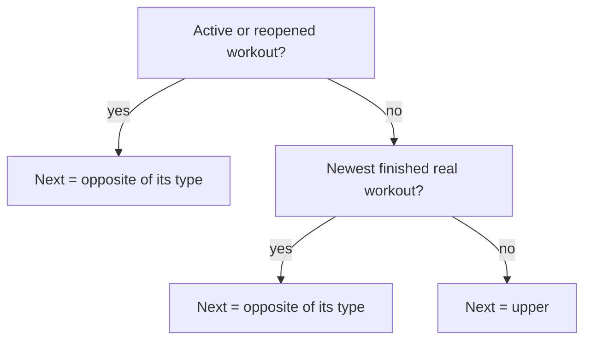
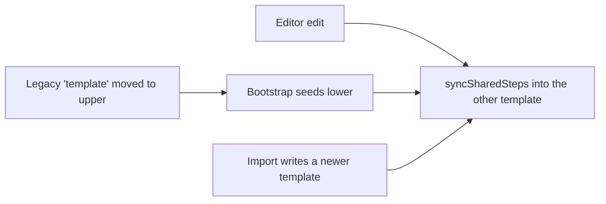

# feat: Lower-body workout, upper/lower alternation, and new warm-up step types

## Summary

Add a second workout, lower body, next to the existing upper-body workout. Every workout records its type, and Home suggests which type comes next so the user can alternate upper and lower. The lower warm-up needs steps counted in reps and steps timed per side. Both warm-ups gain a squat routine whose holds flow into each other without pauses. Jump-rope progression is shared across both workouts. The app is renamed "EG Workout Tracker" and gains a safe Vercel publishing setup.

## Problem Frame

The app models exactly one workout. `WorkoutTemplate.id` is the literal `'default'`, stored under one kv key, and `WorkoutSession` has no type field.

The user now trains upper and lower on alternating days. They need to see which type each past workout was and which one comes next. The lower warm-up includes drills the engine cannot express today, because every warm-up step is a single countdown:

- rep counts ("hip hinges ×10");
- timed sides ("30 s each side");
- a continuous sequence of holds (the squat routine).

The user also wants the app published to production under a new name.

## Requirements

**Lower-body workout**

- R1. A second workout, "Lower body":
  - Bulgarian split squat, single-leg RDL and hip thrust at 3 sets each;
  - sliding hamstring curl at 2 sets;
  - Copenhagen plank at 2 sets per side.
- R2. Lower-body exercises progress by the upper-body rules:
  - 3-set ladder 5/5/5 → … → 6/6/6 → heavier;
  - 2-set ladder 8/8 → … → 10/10 → heavier;
  - timed hold +5 s per side up to its cap;
  - any miss repeats the target.
- R3. The Copenhagen plank is a guided per-side timed hold like the suitcase carry. It has no carry-variation picker, and its wording refers to sides, not dumbbells or hands.

**Warm-ups**

- R4. The lower warm-up runs in this order:
  1. jump rope, plus double unders once unlocked;
  2. ankle rocks, with the cue "knee travels over the toes while the heel stays down";
  3. 90-90 hip switches;
  4. adductor rock-backs;
  5. world's greatest stretch with rotation, 30 s each side;
  6. bodyweight hip hinges ×10;
  7. bodyweight Bulgarian split squat, 6 each side;
  8. glute bridges ×10 with a 1 s pause at the top.

  The squat routine goes in as described in R5.
- R5. Both warm-ups include the squat routine, right after the jump-rope block:
  1. deep squat 30 s;
  2. knee push-outs 30 s;
  3. side-to-side exploration 30 s;
  4. relaxed deep-squat breathing 30 s;
  5. five slow bodyweight squats.

  The four holds run back to back with no get-ready countdown between them.
- R6. Two new warm-up step types:
  - A rep-counted step has no timer and a Done button.
  - A per-side step runs one timer, with a switch-sides cue and side label at the midpoint.
- R7. Jump-rope and double-unders progression continues from the last workout that recorded them, upper or lower.

**Alternation and history**

- R8. Every workout records whether it was upper or lower. Workouts saved before this change count as upper.
- R9. Home suggests the next type and lets the user start either type:
  - the opposite of the workout in progress, if there is one;
  - otherwise, the opposite of the newest finished real workout;
  - otherwise, upper.
- R10. Home shows the most recent workouts with their type and date.
- R11. History, workout detail and the summary label each workout upper or lower. The summary's "Next workout" shows the other type's targets.
- R12. Progress groups exercises by workout type and shows jump rope once.

**Settings, data, and name**

- R13. Settings edits each workout's warm-up and exercises separately. Editing a warm-up step that exists in both workouts updates both.
- R14. Backups carry both workouts. A backup made before this change still restores, and its workout becomes upper.
- R15. Existing data carries over in place: no workouts, targets, overrides or settings are lost, and the stored upper warm-up gains the squat routine.
- R16. Every user-visible name reads "EG Workout Tracker".
- R17. Publishing to Vercel uploads only the built static files. No source file, local secret or tool state leaves the machine.

## Scope Boundaries

- Two fixed workout types. No user-created workouts, custom rotations such as upper/upper/lower, or weekday schedules.
- The suggested type is advice. Nothing blocks two workouts of the same type in a row.
- No weekly-goal scoring, reminders or notifications. The recent list shows the dates, and the user keeps their own cadence.
- Internal identifiers keep the old name: the IndexedDB name `overload`, the localStorage key `overload.active-workout`, and the backup `format: 'overload-backup'`. Renaming them orphans stored data and breaks restoring existing backups.
- Existing demo history is not regenerated. Only fresh installs get alternating demo data.
- Squat-routine durations do not auto-progress.
- Git-driven auto-deploys are out of scope. The publish itself is an operational step (see Documentation / Operational Notes).

## Assumptions

These are bets made in an autonomous run, not confirmed by the user. All are editable in Settings or through Adjust target.

- Lower starting loads:
  - Bulgarian split squat: 12 kg per dumbbell;
  - single-leg RDL: one 16 kg dumbbell;
  - hip thrust: 40 kg (`weight`, 2.5 kg steps);
  - sliding hamstring curl: bodyweight;
  - Copenhagen plank: bodyweight, 20 s per side, growing +5 s to 40 s, with 2.5 kg load steps.
- Rests: 90 s for the split squat, RDL and hip thrust; 75 s for the hamstring curl; 60 s for the Copenhagen plank.
- At 40 s the Copenhagen plank asks the user to choose resistance and restarts at 20 s. The choices are "Stay at bodyweight", which records a harder lever, or added weight. This mirrors bodyweight exercises at their top rung.
- Ankle rocks, 90-90 switches and adductor rock-backs have no stated time. Each gets 45 s, matching the upper drills.
- "Squat routine and progression" means the fixed sequence, not a growing duration.
- The 6-each-side bodyweight split squat takes a single Done for both sides.
- Home-screen label and full name:
  - The iOS home-screen label is "EG Workout", because iOS truncates longer labels.
  - The manifest `name` and the page title are "EG Workout Tracker".

## Acceptance Examples

- AE1. With no real workouts, Home suggests Upper body. Demo history is ignored.
- AE2. The newest finished real workout is Upper, so Home suggests Lower.
  - The user switches to Upper and starts; the session records `upper`.
  - After it finishes, Home suggests Lower.
- AE3. A lower workout is in progress. Home's secondary section reads "Next workout after this one: Upper body".
- AE4. An upper workout completes jump rope at 2:00, so the next target is 2:10. The following lower workout plans 2:10 and completes it. The next upper workout plans 2:20.
- AE5. A lower workout completes jump rope at 5:00. The next upper workout includes double unders at 0:30.
- AE6. Deleting or discarding the newest workout changes the suggestion only by what remains in finished real history.
- AE7. A reopened lower workout is being edited. Home treats it as in progress, so the next type is Upper.
- AE8. A schema-1 backup (one `template`, sessions without a type) is restored:
  - sessions import as upper;
  - the template merges as upper with the squat routine;
  - the local lower workout keeps its own drills and exercises, and its shared rope and squat-routine steps match the restored upper.

## Context & Research

**Relevant code**

- `src/domain/types.ts`: `WorkoutTemplate.id: 'default'`. `WorkoutSession` has no type field. `WarmupStepDef` and `WarmupStepLog` model one countdown each.
- `src/domain/prescription.ts` `deriveCurrentPrescriptions` resolves each target by id across all real history. It ignores templates, so shared warm-up ids carry progression across types with no change.
- `src/domain/progression/warmup.ts` `evaluateWarmup` looks up the double-unders trigger inside the same session, so both workouts must contain both rope steps.
- `src/domain/progression/evaluate.ts:82-92`: at the top of the time range, `evaluateCarry` adds `loadStepKg` and resets the seconds. It never sets `chooseResistance`; `evaluateReps` does at `:47`.
- `src/features/summary/ExerciseResult.tsx` `ChooseResistance` renders only for `reps` logs.
- The warm-up chain lives in `src/domain/workout/actions.ts`, `resync.ts` and `cues.ts`.
  - A completed step moves to a 3 s get-ready, then to the next step.
  - This happens only when the app is visible, the ending is fresh, and the get-ready setting is on.
  - Carry effort stages (`'get-ready' | 'running' | 'switch'`) and `SIDE_SWITCH_MS` are the precedent for sides.
- Data layer:
  - `src/data/db.ts` is at Dexie `version(1)`. Its indexes need no change for this work.
  - `src/data/repositories/templateRepo.ts` uses the kv key `'template'`.
  - `src/data/seed/bootstrap.ts` runs on every app start (`src/app/App.tsx:18`) and seeds one template plus demo history.
- `src/domain/migrate.ts` holds `SCHEMA_VERSION = 1`, the validators, and `migrateSession` / `migrateOverride`. `isValidTemplate` hard-checks `id === 'default'`.
- `src/data/backup.ts`: `BackupFile.template` is singular, and `planImport` compares one `updatedAt`.
- `src/state/mirror.ts` migrates the localStorage copy of the active workout through `migrateSession`.
- Screens:
  - `src/features/home/HomeScreen.tsx` has a single `useTargets()` call and a "Start workout" button.
  - `src/features/workout/CarryExerciseCard.tsx` hardcodes the `MODES` picker and `qualifier="one dumbbell"`.
  - `EffortTimerOverlay.tsx` says "Left hand" and "Pick up the weight".
  - `src/features/progress/ProgressScreen.tsx` hardcodes the `'jump-rope'` lookup.
  - `src/features/summary/SummaryScreen.tsx` passes one `useTargets()` result to both `ExerciseResult` and `NextWorkoutSection`.
- `src/features/settings/WarmupEditor.tsx`:
  - `updateProgression` already cascades a cap change into the dependent activation threshold.
  - `AddStepSheet` adds timed steps only.
- Tests:
  - Vitest tests sit beside the source.
  - `src/test/workoutHarness.tsx` provides `resetApp`, `startWorkout` and `completeWorkout`.
  - `tests/e2e/*` holds the acceptance, restore and offline specs, driven with `page.clock`.
- `tsconfig.json` references `tsconfig.e2e.json`, whose input is `tests/e2e`. `vite.config.ts` loads `pwa-assets.config.ts` for icons. A remote build therefore needs the whole source tree.

**Institutional learnings**

There is no `docs/solutions/` yet. `docs/residual-review-findings/feat-overload-workout-tracker.md` has open findings in files this plan touches:

- untested `parseBackup` paths for a malformed template and a migration failure;
- backups that trust future timestamps;
- untested multi-step `resync` chaining;
- the Home derivation for "next workout after this one".

U4, U5 and U7 address them.

## Key Technical Decisions

- KTD1. Two fixed templates, keyed `'upper' | 'lower'` and stored as kv records `template:upper` and `template:lower`. Alternation needs exactly two. A user-defined list adds UI and validation with no stated use.
- KTD2. Sessions carry `templateId`, stamped by `buildSession`. Inferring the type from exercise ids breaks as soon as a template is edited.
- KTD3. No IndexedDB version bump. The indexes do not change, so the carry-over happens in code:
  - A session without `templateId` reads as upper through one accessor, `workoutTypeOf(session)`. `templateId` stays optional in the type and the validators.
  - `bootstrap` moves the legacy kv `template` record to `template:upper` on startup, inserting the squat routine.
  - The move is idempotent and never throws. A malformed legacy record is left in place, and upper falls back to the seed.

  Rationale: a version bump makes the upgrade one-way. Dexie 4.4 also lets stale v1 code reopen a newer database, so v1-shaped records would keep arriving regardless.
- KTD4. `SCHEMA_VERSION` becomes 2 for records that leave the database, meaning backup files and the localStorage mirror. `migrateSession` stamps `templateId: 'upper'` on a v1 record and its `reopenSnapshot`. `migrateTemplate` turns a v1 `'default'` template into `'upper'` with the squat routine and keeps `updatedAt`, because this is a schema transform, not a user edit.
- KTD5. Shared warm-up steps keep the same ids in both templates: `jump-rope`, `double-unders` and the five squat-routine ids. Derivation already resolves per id across all history, so rope progression, double-unders activation and manual overrides carry across types for free.
- KTD6. Each shared id has one definition, while each warm-up keeps its own order. A pure `syncSharedSteps(source, target)` copies the definitions of ids present in both templates. Every template write runs it:
  - an editor edit mirrors to the other template in the same transaction;
  - bootstrap seeding lower copies from an existing upper;
  - an import syncs from the newer written template into the other.

  Adding, removing and reordering stay per template.
- KTD7. Warm-up steps gain three optional fields, copied onto the step log at session build: `reps`, `perSide` and `flowGroup`. Records without them behave exactly as today.
- KTD8. A rep step keeps `durationSec` as its whole-step time estimate for plan totals. The flow shows the rep count and a Done button and never starts a timer.
- KTD9. A per-side timed step keeps `plannedSec` per side and runs one timer of twice that length. The side label and the midpoint switch-sides cue derive from elapsed time, so reload, lock and resync need no new runtime state.
- KTD10. Consecutive timed steps with the same `flowGroup` run back to back.
  - The next step starts the instant the previous one ends, with no get-ready, whatever the get-ready setting says.
  - This happens only when the app is visible and the ending is fresh, the guard existing chaining uses.
  - A single `go` cue replaces `complete` at the seam.
  - A group member that follows a non-member uses the normal rules, so removing or reordering steps never chains from the wrong step.
- KTD11. The Copenhagen plank reuses the `carry` kind with `style: 'hold'` on the definition and the log. The per-side timer, overlay and evaluation already fit. The style hides the variation picker and switches the wording from hands and weights to sides. A new exercise kind would touch every validator and evaluator.
- KTD12. `evaluateCarry` sets `chooseResistance: true` at the top of the range for bodyweight holds, matching `evaluateReps`. The flag drives Home's "choose load" badge and the summary's resistance chooser. `ChooseResistance` gains a timed variant that saves the chosen load at `scheme.minSec`. "Stay at bodyweight" records a harder lever.
- KTD13. Next-type rule, a pure function in `src/domain/alternation.ts`:
  - an in-progress or reopened workout → the opposite of its type;
  - otherwise, the opposite of the newest finished real workout;
  - otherwise, `'upper'`.

  Demo, discarded and deleted workouts never count.
- KTD14. Backup format v2 carries `templates: WorkoutTemplate[]`. Import merges each template by id with the existing newer-`updatedAt`-wins rule, then runs the KTD6 sync. A v1 file's `template` migrates to upper. Timestamps that are negative or more than 24 h in the future reject the file.
- KTD15. The rename touches user-visible strings, the manifest, the document title and exported file names only (see Scope Boundaries).
- KTD16. Publishing is prebuilt: build locally and upload only the build output.
  - Use `vercel build` + `vercel deploy --prebuilt`, or the equivalent API upload of `dist/`.
  - `vercel.json` pins the Vite build and output directory, and sets `Cache-Control: no-cache` on `sw.js`, `index.html` and `manifest.webmanifest`.
  - `.vercel/` is gitignored.

  Rationale: a remote build would need the whole source tree uploaded, including the `tests/e2e` project reference and `pwa-assets.config.ts`. Prebuilt keeps the gitignored `.gstack/` token directory and any env files on the machine. The no-cache headers let installed PWAs pick up releases.

## High-Level Technical Design

> *Directional sketch, not implementation specification.*

```ts
type TemplateId = 'upper' | 'lower'
interface WorkoutTemplate { id: TemplateId; warmup: WarmupStepDef[]; exercises: ExerciseDef[]; updatedAt: number }
interface WarmupStepDef { /* existing fields */ reps?: number; perSide?: boolean; flowGroup?: string }
interface CarryExerciseDef { /* existing fields */ style?: 'hold' }
interface WorkoutSession { /* existing fields */ templateId?: TemplateId }   // absent = upper (written before this change)
// WarmupStepLog mirrors reps / perSide / flowGroup; CarryExerciseLog mirrors style.
```

Warm-up step behaviour by shape:

| Step shape | Flow display | Primary action | On finish |
|---|---|---|---|
| Timed (today) | countdown `plannedSec` | Start / Pause / Resume | complete → next (get-ready when visible, fresh, and setting on) |
| Timed, `perSide` | current side's countdown; "Left side" / "Right side" | same | 3-2-1 ticks and switch-sides at the midpoint; complete at 2 × `plannedSec` |
| Reps (`reps` set) | "10 reps" or "6 each side", cue | Done (one tap completes and advances); "Next" when revisiting a completed rep step | next timed step follows the get-ready rules |
| Timed in a `flowGroup`, after a timed member of the same group | as timed | as timed | starts at the previous member's expiry with no get-ready when visible and fresh; otherwise waits on Start |

Squat-routine sequence, with the same ids in both workouts:

```
jump-rope → double-unders → deep-squat-hold ⇢ deep-squat-knee-push-outs ⇢ deep-squat-side-to-side ⇢ deep-squat-breathing → slow-squats (5 reps) → …
                            (⇢ = same flowGroup "squat-routine": no get-ready, single "go" cue)
```

Next-type derivation:



Template writes and the shared-step sync:



## Implementation Units

### U1. Domain model, schema v2 records, and migrations

- **Goal:** Add types for two templates, the optional session type, the new warm-up fields and the carry style. Add pure v1→v2 record transforms, validators, and the shared-step helpers.
- **Requirements:** R3, R6, R8, R14, R15
- **Dependencies:** none
- **Files:**
  - `src/domain/types.ts`
  - `src/domain/migrate.ts` and `src/domain/migrate.test.ts`
  - `src/domain/workouts.ts` (new). It holds `TemplateId`, `TEMPLATE_IDS`, `templateLabel`, `otherTemplate` and `workoutTypeOf`.
  - `src/domain/sharedWarmup.ts` (new) and `src/domain/sharedWarmup.test.ts` (new). It holds the rope-block and squat-routine step definitions, `insertSquatRoutine` and `syncSharedSteps`.
  - `src/data/seed/defaultTemplate.ts`, where the seed id becomes `'upper'` so the tree type-checks.
- **Approach:**
  - `SCHEMA_VERSION = 2`.
  - `migrateTemplate(record, fromVersion)`:
    - from v1, sets `id: 'upper'`;
    - runs `insertSquatRoutine`, which places the routine after the last rope-block step when none of its ids are present;
    - keeps `updatedAt`.
  - `migrateSession` stamps `templateId: 'upper'` on a v1 record and on its `reopenSnapshot`, then validates.
  - `syncSharedSteps(source, target)` replaces each target step whose id also exists in the source with the source's definition. Positions and non-shared steps stay.
  - Validators:
    - `isValidTemplate` accepts `'upper' | 'lower'`;
    - warm-up definitions and logs accept optional `reps` (a positive count), `perSide` and `flowGroup`;
    - carry definitions and logs accept an optional `style: 'hold'`;
    - `isValidSession` accepts a missing `templateId` and rejects an unknown one.
- **Execution note:** Test-first. Write the v1 fixture tests for a session, a reopened session, a template and an override before the transforms.
- **Patterns to follow:** existing validators, `isOptional` and `MigrationError` in `src/domain/migrate.ts`.
- **Test scenarios:**
  - A v1 completed session migrates to `templateId: 'upper'`, with other fields unchanged and unknown fields kept.
  - A v1 reopened active session also gets `reopenSnapshot.templateId: 'upper'`.
  - A v1 `'default'` template becomes `'upper'`:
    - the squat routine lands right after `double-unders`, or after `jump-rope` when double unders are absent;
    - `updatedAt` is unchanged.
  - Squat-routine edge cases:
    - a template that already holds a routine id gets no duplicate;
    - a template with no rope steps gets the routine at the start.
  - Record versions:
    - a v2 record passes through unchanged;
    - a version-3 record throws `MigrationError` with the "newer version" message.
  - Validators:
    - reject `templateId: 'legs'`;
    - accept a missing `templateId`;
    - reject `reps: 0` and `reps: 1.5`;
    - accept a step with `reps`, `perSide` and `flowGroup`;
    - reject `style: 'swing'`.
  - `workoutTypeOf` returns `'upper'` for a session without a type.
  - `syncSharedSteps`:
    - copies an edited rope cue and cap into the other template;
    - leaves positions and lower-only steps untouched;
    - does nothing when no ids are shared.
- **Verification:** the migrate and shared-warm-up suites pass, and `tsc -b` is clean.

### U2. Seeds, bootstrap, and alternating demo

- **Goal:** Fresh and existing installs get both workouts, and fresh installs get an alternating demo history.
- **Requirements:** R1, R4, R5, R7, R15
- **Dependencies:** U1
- **Files:**
  - `src/data/seed/defaultTemplate.ts`, which exports `createTemplate(id)` and `createDefaultTemplates()`
  - `src/data/seed/defaultTemplate.test.ts` (new)
  - `src/data/seed/demoHistory.ts` and `src/data/seed/demoHistory.test.ts`
  - `src/data/seed/bootstrap.ts` and `src/data/seed/bootstrap.test.ts`
- **Approach:**
  - The upper warm-up is the rope block, then the squat routine, then the existing four drills.
  - The lower warm-up is the rope block, then the squat routine, then the R4 drills.
  - Lower step ids:
    - `ankle-rocks`, `hip-90-90-switches` and `adductor-rock-backs`: 45 s each;
    - `worlds-greatest-stretch`: 30 s, `perSide`;
    - `hip-hinges`: `reps` 10, estimate 30 s;
    - `bw-split-squats`: `reps` 6, `perSide`, whole-step estimate 60 s;
    - `glute-bridges`: `reps` 10, cue "Pause 1 s at the top", estimate 40 s.
  - Squat-routine ids, all in `flowGroup: 'squat-routine'`:
    - `deep-squat-hold`: 30 s;
    - `deep-squat-knee-push-outs`: 30 s;
    - `deep-squat-side-to-side`: 30 s;
    - `deep-squat-breathing`: 30 s;
    - `slow-squats`: `reps` 5, estimate 30 s.
  - Lower exercises, with loads per Assumptions:
    - `bulgarian-split-squat`: dumbbell, per side, 3×5–6;
    - `single-leg-rdl`: dumbbell, per side, 3×5–6;
    - `hip-thrust`: weight, 3×5–6;
    - `sliding-hamstring-curl`: bodyweight, 2×8–10;
    - `copenhagen-plank`: carry, `style: 'hold'`, bodyweight, per side, 2 sets per side, 20–40 s, +5 s.
  - Bootstrap steps, on every run:
    - (a) move a legacy `template` record to `template:upper`. A newer legacy record wins over an existing `template:upper`, the legacy key is deleted, and a malformed record is left untouched.
    - (b) insert any missing template key, never overwriting. A newly seeded lower first syncs shared steps from an existing upper.
    - (c) seed demo history once, from both templates.
  - Demo history:
    - alternates upper and lower, three per week, oldest first starting with upper;
    - shares one prescription map so the rope carries across types;
    - adds `DEMO_START` entries for the lower exercises.
- **Patterns to follow:** existing seed shapes; the deterministic PRNG in `demoHistory.ts`.
- **Test scenarios:**
  - Both templates validate, and ids are unique within each.
  - Rope, double-unders and squat-routine definitions are deep-equal across the templates.
  - The lower order matches R4, with the routine after the rope block.
  - Set counts: 3/3/3/2 sets, and Copenhagen `setsPerSide` 2.
  - Demo history:
    - alternates upper and lower, and every session carries `templateId`;
    - the rope target keeps growing across demo sessions of different types;
    - every demo session validates.
  - Bootstrap on an empty database creates `template:upper`, `template:lower`, settings and demo history.
  - Bootstrap with only a legacy `template` whose rope cap was edited to 6:00:
    - the legacy key moves to `template:upper` with the squat routine;
    - lower is seeded with the same 6:00 rope cap;
    - the legacy key is gone.
  - A second bootstrap run changes nothing.
  - A malformed legacy record stays in place, upper is seeded from defaults, and bootstrap does not throw.
- **Verification:** unit tests pass, and a fresh install shows both workouts with alternating demo history.

### U3. Template repository and queries

- **Goal:** Read and write templates by id with shared-step mirroring, and expose per-type targets and recent workouts.
- **Requirements:** R7, R8, R10, R13
- **Dependencies:** U1, U2
- **Files:**
  - `src/data/db.ts` (the `KvRecord` union only)
  - `src/data/repositories/templateRepo.ts`
  - `src/data/repositories/templateRepo.test.ts` (new)
  - `src/services/queries.ts` and `src/services/queries.test.ts`
  - `src/app/liveData.ts`
- **Approach:**
  - `KvRecord` gains `template:${TemplateId}` and keeps the legacy `template` shape for the move.
  - `getTemplate(id)` falls back to the seed.
  - `modifyTemplate(id, recipe, now)` does the following in one transaction:
    - runs the read-modify-write;
    - runs `syncSharedSteps` from the edited template into the other;
    - bumps `updatedAt` on every template it changed.
  - `loadPrescriptionContext(templateId)` scans history until that template's targets are covered.
  - `loadRecentWorkouts(limit)` returns the newest real finished sessions: id, type via `workoutTypeOf`, `startedAt` and `finishedAt`.
  - `useTargets(templateId)` and `useRecentWorkouts(limit)` are live queries.
- **Patterns to follow:** the existing `modifyTemplate` transaction; the `until()` scans in `src/services/queries.ts`.
- **Test scenarios:**
  - Editing the `jump-rope` cue in upper updates lower.
  - Editing `ankle-rocks` in lower leaves upper alone.
  - Editing the rope `maxSec` updates the `double-unders` activation threshold in both templates.
  - Removing `deep-squat-hold` from upper leaves it in lower.
  - `loadPrescriptionContext('lower')` returns the lower template. A rope recommendation from an upper session resolves as the lower rope target.
  - `loadRecentWorkouts` returns only real, completed, non-deleted sessions, newest first. An untyped legacy session reports `upper`.
- **Verification:** repository and query tests pass.

### U4. Backup format v2

- **Goal:** Backups carry both templates, v1 backups still restore, and imported dates are sane.
- **Requirements:** R14
- **Dependencies:** U1, U3
- **Files:**
  - `src/data/backup.ts` and `src/data/backup.test.ts`
  - `src/services/dataCommands.ts` and `src/services/dataCommands.test.ts`
  - `src/features/settings/DataSettings.tsx`
- **Approach:**
  - `BackupFile.templates: WorkoutTemplate[]`.
  - `parseBackup(text, now)`:
    - maps a v1 `template` through `migrateTemplate`;
    - requires known, unique template ids and at least one template;
    - rejects any timestamp that is negative or more than 24 h after `now`. The fields are session `startedAt`, `finishedAt`, `updatedAt` and `deletedAt`, override `createdAt` and `updatedAt`, and template and settings `updatedAt`.
  - `planImport` returns each backup template that is newer than the local one with the same id.
  - Restore writes those templates, then syncs shared steps from the newest written template into the other.
- **Patterns to follow:** existing `planImport` rules and `BackupError` messages.
- **Test scenarios:**
  - A v2 round trip keeps both templates and session types.
  - A v1 fixture (one `template`, untyped sessions) parses:
    - sessions become upper;
    - `templates` holds only an upper template that includes the squat routine.
  - Restoring it with a newer upper template:
    - keeps lower's own drills;
    - aligns lower's rope steps with the imported upper.
  - An equal `updatedAt` keeps the local copy.
  - `BackupError` is thrown for:
    - an unknown template id;
    - duplicate template ids;
    - an empty `templates` array;
    - a v1 file with a malformed session (the migration-failure path);
    - a session `finishedAt` two days in the future, with the message "This backup has dates in the future.";
    - a v3 file, refused with the "newer version" message.
- **Verification:** backup and data-command tests pass.

### U5. Workout engine: typed start, new warm-up step shapes, hold evaluation

- **Goal:** Start either workout type, run rep, per-side and grouped warm-up steps, and evaluate bodyweight holds.
- **Requirements:** R2, R3, R5, R6, R7, R8
- **Dependencies:** U1, U3
- **Files:**
  - `src/domain/session.ts` and `src/domain/session.test.ts`
  - `src/domain/workout/actions.ts` and `src/domain/workout/actions.test.ts`
  - `src/domain/workout/resync.ts` and `src/domain/workout/resync.test.ts`
  - `src/domain/workout/cues.ts` and `src/domain/workout/cues.test.ts`
  - `src/domain/progression/evaluate.ts` and `src/domain/progression/evaluate.test.ts`
  - `src/services/workoutCommands.ts` and `src/services/workoutCommands.test.ts`
  - `src/state/workoutStore.ts`
  - `src/test/workoutHarness.tsx`
- **Approach:**
  - `buildSession`:
    - stamps `templateId`;
    - copies `reps`, `perSide` and `flowGroup` to step logs, and `style` to carry logs;
    - starts a `style: 'hold'` log in mode `hold`.
  - Timer math:
    - `stepWorkMs(step)` is 2 × `plannedSec` when `perSide`. It replaces `plannedMs` in the timer math of `actions.ts` and `resync.ts`.
    - `sideAt(step, remainingMs)` returns the current side.
  - `completeRepStep`:
    - marks the step complete, with elapsed equal to `plannedSec`;
    - moves to the next active step in the same tap;
    - a timed next step gets a get-ready only when the setting is on;
    - on the last step, the phase becomes `warmup-complete`;
    - on a timed step it is a no-op.
  - `startWarmupStep`, pause and resume are no-ops on rep steps.
  - Both `resync` branches guard rep steps. A get-ready never starts a timer for a rep step, and completion never schedules a get-ready into one.
  - `resync` group chaining. When a timed step expires, the next active step starts at the expiry instant with a single `go` and no `complete` if all of these hold:
    - the next step is timed;
    - it shares the expired step's `flowGroup`;
    - the app is visible and the ending is fresh.

    Otherwise the existing rules apply.
  - `countdownTicks` adds 3-2-1 ticks and a `switch-sides` event at the midpoint of a running per-side warm-up timer.
  - `evaluateCarry` adds `chooseResistance: true` at the top of the range when the load type is bodyweight.
  - `startWorkout(templateId, now)` and the store's `start(templateId)` replace the single-template start. The harness helpers take a type that defaults to upper.
- **Execution note:** test-first for resync and cues. Include the residual multi-step chaining test: get-ready → work → done in one `resync`, and a second `resync` changes nothing.
- **Patterns to follow:**
  - carry side handling in `resync.ts` (`SIDE_SWITCH_MS`, the switch stage);
  - `toggleSet` done/pending semantics;
  - `isFresh` gating.
- **Test scenarios:**
  - `buildSession` for lower:
    - records `templateId: 'lower'`;
    - carries the step fields;
    - gives the Copenhagen log `style: 'hold'` and `mode: 'hold'`.
  - Rep steps:
    - Done completes and advances in one call;
    - a timed next step starts a get-ready when the setting is on;
    - a rep next step starts no timer;
    - on the last step the phase becomes `warmup-complete`;
    - `startWarmupStep` on a rep step is a no-op.
  - Per-side step of 30 s:
    - the timer is 60 s;
    - crossing the 30 s mark emits ticks 3-2-1, then one `switch-sides`;
    - a hidden-tab jump across the midpoint emits nothing;
    - pausing at 40 s elapsed and resuming keeps the side right;
    - expiry at 60 s completes it.
  - Squat routine:
    - when `deep-squat-hold` expires while visible and fresh, `deep-squat-knee-push-outs` runs at once (`endsAt` = expiry + 30 s), with one `go` and no `complete`;
    - the same happens with the get-ready setting off;
    - when the app is hidden, the next step waits unstarted;
    - when `deep-squat-breathing` expires, `slow-squats` becomes current with no timer.
  - Group edge cases:
    - with `deep-squat-hold` removed, rope expiring before `deep-squat-knee-push-outs` follows the normal get-ready rules;
    - after a reorder that splits the group, only adjacent members chain.
  - `evaluateCarry`:
    - a bodyweight hold at 40 of 40 s returns `increase-load`, `chooseResistance` and seconds 20;
    - 35 s advances to 40;
    - a failure repeats;
    - a dumbbell carry at the top returns no `chooseResistance`.
  - `startWorkout('lower')` inserts a lower session whose rope target comes from an earlier upper session (AE4).
  - Rope completed at 5:00 activates double unders in the next workout of either type (AE5).
- **Verification:** `npm test` passes and `tsc -b` is clean.

### U6. Warm-up and workout UI for new step shapes and the hold style

- **Goal:** The guided warm-up shows reps and sides, and the Copenhagen plank reads as a hold.
- **Requirements:** R3, R4, R5, R6
- **Dependencies:** U5
- **Files:**
  - `src/features/warmup/WarmupScreen.tsx`, `WarmupScreen.module.css` and `WarmupScreen.test.tsx`
  - `src/features/warmup/WarmupComplete.tsx`
  - `src/features/workout/CarryExerciseCard.tsx` and `EffortTimerOverlay.tsx`
  - `src/features/workout/CarryExerciseCard.test.tsx` (new)
  - `src/features/home/warmupPlan.ts`
  - `src/domain/format.ts`, for the new `formatWarmupTarget`
- **Approach:**
  - `stepView` handles rep steps:
    - a big count ("10", with "reps" or "each side" under it) and the cue;
    - primary "Done", or "Next" when revisiting a completed rep step;
    - Previous, Skip and Next remain.
  - Per-side timed steps show the current side's remaining time and a "Left side" / "Right side" label, while the progress bar tracks the whole step.
  - `CarryExerciseCard`:
    - with `style: 'hold'`, it hides the variation picker, and the target reads "20 s per side × 2";
    - the "one dumbbell" qualifier shows only for dumbbell carries.
  - Hold overlay copy:
    - "Get into position" while getting ready;
    - "Left side · Set 1" while running;
    - "Switch sides" at the switch.
  - `warmupPlan` doubles only per-side timed steps in totals. A rep step's estimate covers the whole step.
  - `formatWarmupTarget` renders "10 reps", "6 each side" or "30 s each side" everywhere planned warm-up values appear: Home, `WarmupComplete`, summary, detail and editor.
- **Patterns to follow:** the existing `WarmupScreen` mode map and CSS tokens; the 375 px layouts fixed in the prior QA.
- **Test scenarios:**
  - A rep step renders its count and Done with no timer, and tapping Done shows the next step.
  - A per-side step shows "Left side" and 0:20 at 10 s of 60, and "Right side" and 0:20 at 40 s.
  - The Copenhagen card shows no radiogroup and no "one dumbbell". The suitcase carry still shows both.
  - The hold overlay says "Switch sides", not "hands".
  - `WarmupComplete` lists "10 reps" for hip hinges.
  - `formatWarmupTarget` covers all four shapes.
- **Verification:** component tests pass, and U11 checks the 375 px layout.

### U7. Home: next type, switch, recent workouts

- **Goal:** Home tells the user what they did recently and which workout is next, and starts either type.
- **Requirements:** R9, R10
- **Dependencies:** U3, U5
- **Files:**
  - `src/domain/alternation.ts` and `src/domain/alternation.test.ts` (both new)
  - `src/features/home/HomeScreen.tsx`, `HomeScreen.module.css` and `HomeScreen.test.tsx`
  - `src/features/home/NextWorkoutList.tsx`
  - `src/features/home/RecentWorkouts.tsx` (new)
  - `src/features/targets/TargetEditorSheet.tsx`
  - `src/app/App.test.tsx`
- **Approach:**
  - `nextTemplateId(active, recent)` implements KTD13.
  - The "Next workout" section:
    - an Upper / Lower segmented switch, preselected to the suggestion;
    - a caption under it, such as "Suggested: Lower body · last workout was upper, Mon 21 Sep", or "Suggested: Upper body" when there is no history;
    - the target list for the selected type;
    - a start button reading "Start upper body" or "Start lower body".
  - The selection is Home-local state and resets to the suggestion whenever Home mounts.
  - "Recent" lists up to 4 of the newest real workouts, newest first, one row each (for example "Mon 21 Sep · Upper body").
    - Each row opens that workout's detail.
    - With none, it shows "No workouts yet".
    - While loading, nothing renders, and the section sits below the start controls so nothing jumps.
  - While a workout is active or reopened:
    - the section reads "Next workout after this one" and shows the other type;
    - the active card names the type, whether fresh ("Lower body in progress") or stale ("Unfinished lower-body workout from …").
  - `TargetEditorSheet` edits the targets of the shown template.
- **Patterns to follow:** `SegmentedControl` in `src/features/settings/SettingsControls.tsx`; existing Home section styles.
- **Test scenarios:**
  - `nextTemplateId`:
    - no history → upper;
    - last upper → lower;
    - last lower → upper;
    - active lower → upper;
    - reopened upper → lower;
    - demo, discarded and deleted sessions are ignored;
    - an untyped legacy session counts as upper.
  - Home selection and start:
    - the suggestion is preselected and captioned;
    - switching swaps the list;
    - Start starts the selected type;
    - remounting Home resets the selection.
  - Home with an active workout:
    - Resume replaces Start;
    - the secondary section shows the other type;
    - the stale card names the type.
  - Recent:
    - shows the newest 4 with type and date;
    - shows "No workouts yet" when empty;
    - a row opens its detail.
  - The demo-choice sheet still appears before the first real start, then starts the selected type.
- **Verification:** component tests pass, and U11 checks the 375 px layout.

### U8. History, summary, and progress by type

- **Goal:** Every past workout shows its type, and Summary and Progress understand two workouts.
- **Requirements:** R3, R11, R12
- **Dependencies:** U3, U5
- **Files:**
  - `src/domain/history.ts`
  - `src/features/history/HistoryScreen.tsx`, `SessionDetailScreen.tsx`, `SessionDetailScreen.test.tsx` and `History.module.css`
  - `src/features/summary/SummaryScreen.tsx`, `NextWorkoutSection.tsx`, `SummaryScreen.test.tsx` and `ExerciseResult.tsx`
  - `src/features/progress/ProgressScreen.tsx` and `ExerciseProgressScreen.tsx`
- **Approach:**
  - History rows carry an "Upper" or "Lower" badge next to the existing demo badge.
  - The detail eyebrow reads "Upper body workout".
  - `SummaryScreen` loads two target sets:
    - `useTargets(session.templateId)` for `ExerciseResult`;
    - `useTargets(otherTemplate(…))` for `NextWorkoutSection` and its `TargetEditorSheet`.
  - The summary title names the type.
  - `ChooseResistance` gains the timed-hold variant from KTD12:
    - a load stepper and a "Stay at bodyweight" button;
    - both save `seconds: scheme.minSec`.
  - Progress:
    - shows one jump-rope card found in either template;
    - groups exercises into "Upper body" and "Lower body" sections, in that order;
    - `ExerciseProgressScreen` resolves an id across both templates.
- **Test scenarios:**
  - A lower detail shows "Lower body workout" and lower exercises.
  - A lower summary lists upper next targets, including this workout's rope result.
  - Choose resistance:
    - on `sliding-hamstring-curl` at the top rung, the saved load shows immediately;
    - on a Copenhagen plank that finished 2×40 s per side, "Stay at bodyweight" saves BW at 20 s.
  - Progress shows jump rope once and both sections, and `#/progress/copenhagen-plank` resolves.
- **Verification:** component tests pass.

### U9. Settings per workout with shared-step sync

- **Goal:** Edit each workout separately while shared steps stay in sync.
- **Requirements:** R6, R13
- **Dependencies:** U3, U6
- **Files:**
  - `src/features/settings/SettingsScreen.tsx`
  - `src/features/settings/settingsActions.ts` and `settingsActions.test.ts` (new)
  - `src/features/settings/WarmupEditor.tsx` and `WarmupEditor.test.tsx`
  - `src/features/settings/ExerciseListEditor.tsx`
  - `src/features/settings/ExerciseEditor.tsx` and `ExerciseEditor.test.tsx`
- **Approach:**
  - Routes:
    - `settings/:templateId/warmup`, `settings/:templateId/exercises` and `settings/:templateId/exercises/:exerciseId`;
    - an unknown template id redirects to the settings root;
    - the old `settings/warmup` and `settings/exercises…` paths redirect to upper.
  - The settings root shows one group per workout, each with Warm-up and Exercises.
  - `updateTemplate`, `updateWarmupStep` and `updateExercise` take a `templateId` and write through `modifyTemplate`.
  - `WarmupEditor`:
    - rep steps get a Reps stepper (1–50), and timed steps keep the duration stepper;
    - both offer an "Each side" toggle;
    - grouped steps show "Flows straight on from the previous squat-routine step";
    - shared steps show "Also in the upper/lower warm-up";
    - removing a step that other steps unlock from warns, for example "Double unders unlock from this step. Without it they stay off in this workout.";
    - `AddStepSheet` offers Time or Reps.
  - The carry editor keeps `style` and exposes no control for it.
- **Patterns to follow:** existing `Field` and `Stepper` controls, the `updateProgression` cascade and `NameField`.
- **Test scenarios:**
  - The lower warm-up editor lists the R4 steps. Changing hip hinges to 12 reps persists to lower only.
  - Changing the rope cue in lower changes upper, and the note is visible.
  - Adding a Reps step creates a step with `reps` and an estimate.
  - Toggling "Each side" on ankle rocks persists `perSide`.
  - Removing jump rope from lower shows the unlock warning, and upper keeps jump rope.
  - Routing:
    - `#/settings/exercises` lands on the upper exercise list;
    - `#/settings/legs/warmup` redirects to the root.
  - Removing the last lower exercise is blocked.
- **Verification:** component tests pass.

### U10. Rename and publishing configuration

- **Goal:** Rename the app to "EG Workout Tracker" and make the repo ready to publish prebuilt output.
- **Requirements:** R16, R17
- **Dependencies:** none. Land it after U9 to avoid churn in the same files.
- **Files:**
  - `index.html`, `vite.config.ts`, `package.json`, `package-lock.json`, `README.md` and `.gitignore`
  - `src/features/settings/SettingsScreen.tsx`
  - `src/features/home/InstallTip.tsx`
  - `src/data/backup.ts` and `src/data/backup.test.ts`
  - `src/features/settings/backupFlow.ts` and `src/features/settings/DataSettings.test.tsx`
  - `src/features/recovery/RecoveryScreen.tsx` and `src/features/recovery/WorkoutError.tsx`
  - `src/features/workout/WorkoutStatusBars.tsx`
  - `tests/e2e/offline.spec.ts`
  - `vercel.json` (new)
- **Approach:**
  - Names and descriptions:
    - the manifest `name` and `<title>` are "EG Workout Tracker";
    - `short_name` and `apple-mobile-web-app-title` are "EG Workout";
    - descriptions say "upper- and lower-body workouts".
  - The Settings footer, the install tip and the backup error message use the new name.
  - Export file names:
    - `eg-workout-tracker-backup-YYYY-MM-DD.json`;
    - `eg-workout-tracker-workout-<id>.json`;
    - `eg-workout-tracker-unreadable-workout.json`.
  - `package.json` name becomes `eg-workout-tracker` and version `0.2.0`, and the lockfile follows.
  - Internal identifiers keep their names (KTD15).
  - `.gitignore` gains `.vercel`.
  - `vercel.json` sets `framework: "vite"`, `buildCommand: "npm run build"`, `outputDirectory: "dist"` and the no-cache headers.
- **Test scenarios:**
  - The offline e2e expects manifest `short_name` "EG Workout" and `name` "EG Workout Tracker".
  - The backup export file name matches `/^eg-workout-tracker-backup-\d{4}-\d{2}-\d{2}\.json$/`, and the payload `format` stays `overload-backup`.
  - A non-backup JSON shows "This file is not an EG Workout Tracker backup."
- **Verification:**
  - `npm run build` succeeds.
  - A grep of `src`, `index.html` and `vite.config.ts` finds no user-visible "Overload".
  - `dist/manifest.webmanifest` lists the 192 px, 512 px and maskable icons.

### U11. End-to-end coverage and docs

- **Goal:** Prove the lower-body flow, alternation and rope continuity in a real browser, and document the change.
- **Requirements:** R1–R16
- **Dependencies:** U1–U10
- **Files:**
  - `tests/e2e/lower-body.spec.ts` (new)
  - `tests/e2e/helpers.ts`, `tests/e2e/acceptance.spec.ts` and `tests/e2e/restore.spec.ts`
  - `README.md`
- **Approach:**
  - `startWorkout(page, type)` clicks "Start upper body" or "Start lower body".
  - The new spec drives a lower workout with `page.clock`:
    - rope;
    - the squat routine, whose holds auto-advance without get-ready;
    - `slow-squats` Done;
    - ankle rocks through glute bridges, with the per-side label switching at 30 s;
    - logging the five exercises, including the Copenhagen hold timer;
    - Finish.
  - It then asserts that Home suggests Upper, History shows a Lower badge, and the next upper rope target reflects the lower workout.
  - A restore case imports a schema-1 backup fixture into a fresh install and checks the AE8 outcomes.
  - The README covers both workouts, alternation, the warm-up step types, backup compatibility and publishing.
- **Test scenarios:** as described above. The existing acceptance spec passes against upper.
- **Verification:** `npx playwright test` passes on the mobile project.

## System-Wide Impact

- **Data carry-over:** there is no IndexedDB version bump, so the database stays openable by the previous build:
  - The only rewrite is bootstrap's legacy `template` move.
  - A v1 build that opens the database afterwards sees no `template` key and falls back to its seed. Its data stays intact.
  - Sessions a stale v1 tab writes without a type read as upper.
- **Active workout across the update:** a workout in progress keeps its planned v1 warm-up, without the squat routine, and reads as upper.
- **Target derivation:** an override on a shared id such as `jump-rope` applies to both workouts. Exercise ids are distinct across templates, so strength targets never cross.
- **Backups:** the previous build refuses v2 files with its existing "newer version" message.
- **Storage origin:** browser data is per origin. Workouts on `localhost` do not appear on the production URL; move them with Backup → Restore.

## Risks & Dependencies

| Risk | Mitigation |
|---|---|
| Shared warm-up definitions drift between templates | One `syncSharedSteps` path on every template write: editor, seeding and import (KTD6); tests in U1–U4 |
| Group chaining fires from the wrong step after edits | Chain only between adjacent timed members of the same `flowGroup` (KTD10); tests for removal and reorder |
| Midpoint switch cue fires twice, or never, on frame jitter | Boundary-crossing logic reused from `countdownTicks`, with freshness gating; tests for jitter and hidden gaps |
| iOS suspends timers in the background mid-routine | Timestamp timers resolve on return; a hidden seam waits for Start rather than running on silently; keep-awake stays on during the warm-up |
| Crafted or corrupted backups pin targets with future dates | Timestamp bounds check in `parseBackup` (KTD14) |
| A publish uploads local files | Prebuilt upload of build output only (KTD16); `.vercel` gitignored |

## Documentation / Operational Notes

- The README covers both workouts, the alternation, the warm-up step types, and a "Backup compatibility" note that schema-1 backups restore as upper.
- Before the new build first loads on an origin that holds real workouts, such as the localhost dev server, export a backup there with the current build.
- **Publishing:**
  - Publish the prebuilt output to production on the account the user named (egroner80), project `eg-workout-tracker`.
  - Check a preview deployment first: the app loads and the manifest lists its icons.
  - The CLI on this machine is not logged in, and the Vercel connector is signed in to the team "eran-6000's projects". Confirm the account before publishing.
  - Record the production alias URL. Per-deployment URLs sit behind Vercel's deployment protection.
- After installing on the phone, restore a backup to bring over localhost data. Demo history on the new origin can be cleared from Home.

## Sources & References

- Original plan: `docs/plans/2026-09-27-001-feat-upper-body-workout-tracker-pwa-plan.md`
- Residual findings: `docs/residual-review-findings/feat-overload-workout-tracker.md`
- Code seams:
  - `src/domain/prescription.ts:83-130`
  - `src/domain/progression/evaluate.ts:57-99`
  - `src/domain/workout/resync.ts:38-141`
  - `src/domain/workout/cues.ts:39-48`
  - `src/data/backup.ts:66-107`
  - `src/data/seed/bootstrap.ts:11-31`
  - `src/features/summary/ExerciseResult.tsx:50-80`
