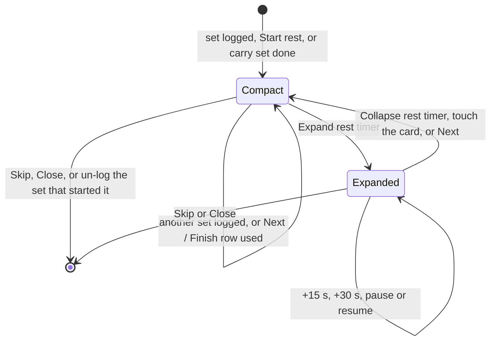

# fix: Keep set controls visible while the rest timer runs

## Summary

Logging a set opens a large rest sheet that covers the set chips and the − / + rep buttons, so correcting the reps of the set just logged means minimizing the timer first. Rest will instead show as a compact countdown inside the bottom action bar, beside a narrowed Next / Finish button. The action bar keeps its height, so the card looks and scrolls the same with or without rest. The large view stays one tap away.

---

## Problem Frame

The expanded rest sheet is a fixed bottom overlay, 265–346 px tall: header, countdown digits sized `clamp(4.5rem, 24vw, 10rem)`, a four-button row, and a "Next" button once every set is logged. On a 390×844 viewport it starts around y=503–579, while the set column's − button sits at y≈535–583. Two-line exercise names and the 44 px keep-awake bar push the column lower. The user trains on a Galaxy S23 installed app (about 360×700–735 CSS px), where the minimized bar, floating 96 px above the bottom, can also cover − on exercises whose names wrap.

Measurements on the built app at 360×700 show the set row of a two-line exercise ends within a few pixels of the action bar's top edge. Any bottom chrome added above the action bar clips the row, so the fix has to add no height there.

A prior QA fix removed an invisible scrim and made any touch on the card collapse the sheet without swallowing the tap. That keeps one-tap logging working, but covered controls still can't be touched until the sheet is minimized.

---

## Requirements

**Set logging during rest**
- R1. Rest adds no height over or under the card. While a rest countdown runs, the current exercise's set chips and − / + buttons stay where they are without rest, unobstructed and tappable, without minimizing or skipping the timer. This holds at 360×700 with the keep-awake bar dismissed, on two-line exercise names, on exercises opened while rest runs, and after a reload.
- R2. One tap on a pending chip during rest still logs that set, and Next / Finish stays tappable during rest.

**Rest timer**
- R3. During rest the countdown and its state (running, paused, done with overtime) stay on screen, with Skip / Close in the compact timer.
- R4. The large view (big digits, +15 s, +30 s, pause / resume, Skip / Close, Next: exercise) opens from the compact timer.
- R5. Carry and hold exercises get the same rest behavior.

**Continuity**
- R6. A workout in progress when the update lands restores its rest timer after reload. Persisted `expanded: true` still shows the large view.

---

## Key Technical Decisions

- KTD1. Rest opens compact; the large view is on demand. Every path that starts rest (logging a set, stepping a pending set's reps, Start rest, finishing a carry set) sets `expanded: false`.
- KTD2. The compact timer lives in the action bar, which keeps its 72 px row. During rest the row holds the compact timer and a narrowed Next / Finish button. The card's scroll area is the same size with or without rest, so nothing shifts under the thumb when rest starts and nothing new can cover the set row. Rejected alternatives:
  - An in-flow panel above the action bar with auto-scroll. At 360×700 any panel over ~30 px clips the set row, moves the card under the thumb on log, and leaves the row clipped on exercises opened mid-rest.
  - A countdown in the top bar's centre slot. Its digits are smaller and far from the thumb, and it hides the exercise position.
  - Compacting the card on short screens. That is a broad visual change beyond the request.
- KTD3. The compact timer shows only the state label, the countdown, and Skip / Close. +15 s, +30 s and pause / resume stay in the large view, and `addRestTime` keeps its current behavior.
- KTD4. Keep the one-tap rules from the prior QA fix: no scrim, and touching the card collapses the large view without swallowing the tap.
- KTD5. One accessibility contract for both sizes, with exactly one rendered at a time:
  - Each is a region named "Rest timer".
  - Its `timer` element contains only the countdown (`1:58`, `+0:12`) and sits outside any button, because `acceptance.spec.ts` and `restore.spec.ts` parse that text.
  - The compact timer has an "Expand rest timer" button and a "Skip" / "Close" button. The large view keeps "Collapse rest timer".
  - Both sizes label the state Rest, Rest paused, or Rest done.
  - Expanding with the button moves focus to "Collapse rest timer"; collapsing with it returns focus to "Expand rest timer".
- KTD6. No schema change: `RestRuntime.expanded` keeps its meaning (false = compact timer, true = large view), and `isValidRuntime` is untouched.

---

## High-Level Technical Design

Rest UI states. "Paused" is a property of either size: the compact timer reads Rest paused, and resume lives in the large view.

Action bar row during compact rest: the compact timer (flex 1; label over countdown, the whole face expands it; Skip / Close at its end), then the narrowed Next / Finish button. Without rest the row is today's full-width Next / Finish. The large view stays a fixed overlay above everything.

---

## Implementation Units

### U1. Rest starts compact

- **Goal:** Every way of starting rest leaves it compact.
- **Requirements:** R1, R5, R6
- **Dependencies:** none
- **Files:**
  - Modify: `src/domain/workout/actions.ts` (`startRestFor`), `src/domain/workout/resync.ts` (carry-set completion)
  - Test: `src/domain/workout/actions.test.ts`, `src/domain/workout/resync.test.ts`
- **Approach:** `startRestFor` writes `expanded: false`, and the carry-completion branch in resync does the same. `setRestExpanded` and `addRestTime` are unchanged.
- **Patterns to follow:** existing pure action style in `actions.ts`.
- **Test scenarios:**
  - Tapping a pending chip starts rest with `expanded: false` and `startedBySet` set to that set. The assertion at `actions.test.ts:99` changes from true to false.
  - Stepping a pending set's reps starts compact rest once; stepping again doesn't restart it.
  - Start rest begins compact rest.
  - Finishing a carry set starts compact rest (`resync.test.ts`).
  - A runtime with `expanded: true` passes through hydration and resync unchanged.
- **Verification:** domain tests pass, and only an explicit expand or `addRestTime` from the large view sets `expanded: true`.

### U2. Compact rest timer in the action bar

- **Goal:** The compact state moves into the action bar without changing its height; the large view stays an on-demand overlay.
- **Requirements:** R2, R3, R4, R5, R6
- **Dependencies:** U1
- **Files:**
  - Modify: `src/features/rest/RestTimerSheet.tsx`, `src/features/rest/RestTimerSheet.module.css`
  - Modify: `src/features/workout/StrengthScreen.tsx`, `src/features/workout/StrengthScreen.module.css`
  - Test: `src/features/workout/StrengthScreen.test.tsx`, `src/features/workout/CarryExerciseCard.test.tsx`; create `src/features/rest/RestTimerSheet.test.tsx`
- **Approach:**
  - Render the compact timer inside `.actionBar` while rest is active and not expanded, beside the Next / Finish button. That button narrows but keeps its accessible name ("Next: Dips", "Finish workout").
  - Give the compact timer a fixed 72 px face in every state: a small label above ~2.25rem tabular digits, and a 48 px Skip / Close.
  - Confirm at 360 px that "Rest paused" with `12:30`, and `+12:30` overtime, fit without wrapping or growing the row.
  - The expand button covers the label and countdown; the `timer` element sits outside it (KTD5).
  - Keep the large view as today's fixed sheet. Its title also shows Rest paused.
  - Remove the floating `.bar` and the `.content` bottom padding reserved for it.
  - Move focus on button-driven expand and collapse (KTD5). Update the component docstring.
- **Patterns to follow:** `.barMain` colours (`--rest`, `--rest-soft`, `--accent` when done), `Button` sizes and `.xl` wrapping in `src/components/Button.module.css`, and the `.actionBar` safe-area padding.
- **Test scenarios:**
  - Tapping a chip shows region "Rest timer" whose timer text is exactly "1:30", with Expand rest timer and Skip. Pause is not shown, and set 1's − / + stay enabled.
  - During compact rest the action bar offers exactly one "Next: Dips", and it navigates; rest follows in compact form.
  - Expand rest timer opens the large view with +15 s, +30 s, Pause and Collapse rest timer, focused on Collapse rest timer. Collapse returns to compact with focus on Expand rest timer.
  - Pausing in the large view and collapsing shows "Rest paused" in the compact timer.
  - With the large view open, a pointer-down on the card collapses it and the chip tap still logs in one tap.
  - Skip removes the region. After the countdown ends the compact timer reads "Rest done" with overtime "+0:12" and a Close button.
  - Large view with every set logged: its Next: exercise navigates and returns to compact.
  - A carry exercise logging a set shows the compact region (`CarryExerciseCard.test.tsx`).
  - Hydrating rest with `expanded: true` renders the large view, and only one "Rest timer" region exists.
- **Verification:** both sizes meet the KTD5 contract. The action bar is the same height with and without rest, which U4 checks in a browser.

### U4. Phone-height end-to-end coverage and docs

- **Goal:** Prove R1 and R2 in a real browser at a short phone viewport, and update user-facing docs.
- **Requirements:** R1, R2, R3, R6
- **Dependencies:** U1, U2
- **Execution note:** Write the geometry checks first and confirm they fail against the current build; they pass once U1 and U2 land.
- **Files:**
  - Create: `tests/e2e/rest-timer.spec.ts`
  - Modify: `tests/e2e/helpers.ts` (only if a helper needs the new structure); `README.md`
- **Approach:**
  - Pin the viewport to 360×700. Stub `navigator.wakeLock` so the keep-awake bar stays dismissed, as on the device.
  - Measure targets instead of trusting `click()`. Playwright scrolls a covered target into view inside the card before clicking, so actionability alone can't prove R1. For each target, assert `toBeInViewport({ ratio: 1 })` and that `document.elementFromPoint` at its centre returns it, then tap with `page.mouse.click` at that point.
  - Run the flow on Bulgarian split squat (a two-line name at this width):
    - Record set 1's −, chip and + boxes, then log set 1.
    - Assert the boxes are unchanged and pass the checks, then tap set 1's −.
    - Log set 2 and tap set 2's +, asserting the reps and that rest is still running.
    - Tap Next. On Single-leg RDL, check set 1's controls with rest still running. Reload and check again.
  - Keep `skipRest` in the existing specs. Re-run `restore.spec.ts` and `acceptance.spec.ts` against the compact default.
  - Update the README rest-timer description.
- **Test scenarios:**
  - At 360×700, logging a set leaves that set's −, chip and + in place, unobstructed and tappable during rest.
  - An exercise opened during rest shows its set row unobstructed without scrolling.
  - After a reload mid-rest, region "Rest timer" shows the remaining time and the set row stays unobstructed (`restore.spec.ts` expectations unchanged).
  - The countdown reaches "Rest done" and Close dismisses it (`acceptance.spec.ts`).
- **Verification:** the new spec fails on the old build and passes on the new one, the full Chromium e2e suite passes, and the README matches the behavior.

---

## Scope Boundaries

- No change to rest durations, cues (sound, vibration, flash), the effort overlay, or the set-column design.
- The large view's layout is unchanged apart from becoming opt-in and showing Rest paused.
- Card controls that already sit below the action bar without rest are out of scope; rest no longer makes them worse. Examples are a carry card's second set on a short screen, or rows pushed down by the keep-awake bar.

### Deferred to Follow-Up Work

- A real-device pass on iOS 26 standalone for safe-area spacing, per the README device checklist.
- Tests for `addRestTime` after rest has finished, and for +30 s (a residual finding from the first plan's review).

---

## Assumptions

- The user wants the timer itself to stay visible while resting. A compact countdown in the action bar, with the big view one tap away, fits "adjust the size of the timer" better than hiding it.
- 360×700 stands in for the Galaxy S23 installed app with on-screen navigation buttons; the device's real viewport wasn't measured.
- Moving +15 s into the large view (two taps instead of one) is acceptable; the compact timer keeps Skip / Close.

---

## Risks

| Risk | Mitigation |
|---|---|
| The narrowed Next / Finish label wraps to two lines during rest. | `.xl` buttons already wrap within 72 px; U4's run at 360 px shows the result. |
| Test churn where tests reach the large view through set logging. | U2 rewrites those flows through Expand rest timer; e2e selectors stay stable (KTD5). |
| Compact digits (~2.25rem) are smaller than the large view's ~86 px. | The large view is one tap away, and end-of-rest cues are unchanged. |

---

## Sources & Research

- `src/features/rest/RestTimerSheet.tsx`: compact (`!rest.expanded`, lines 41-56) and large (58-111) views. The compact bar's `role="timer"` wraps its buttons today.
- `src/features/rest/RestTimerSheet.module.css`: `.sheet` (fixed, z 31) and `.bar` (fixed at `bottom: calc(var(--safe-bottom) + var(--tap-xl) + var(--space-6))`, z 25).
- `src/features/workout/StrengthScreen.tsx`: the card's pointer-down collapse (87-93) and the action bar (108-124). The sheet renders after the action bar (126).
- `src/domain/workout/actions.ts` `startRestFor` (266-277); `src/domain/workout/resync.ts` carry completion (140-145).
- Measured on the built app: at 390×844 the sheet covers from y=579, or y=503 with Next. At 360×700 a two-line exercise's set 1 − spans y≈555–603 against an action bar top of y≈604, and any extra bottom chrome clips it.
- `tests/e2e/acceptance.spec.ts:92` and `tests/e2e/restore.spec.ts:126-136` read the timer text; `tests/e2e/helpers.ts` `skipRest` clicks "Skip" in region "Rest timer".
- Commit `dbb67e2` (one-tap logging during rest, scrim removal).
